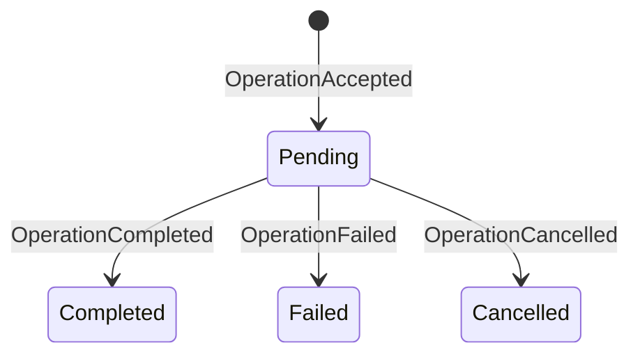

# Durability model

Nanocodex has one durability protocol. Rust owns it. Hosts store one opaque,
complete current-state value, and application layers project those facts for
their own APIs. Recovery loads one total state value.

The protocol protects the entire execution lifecycle: prompt admission, model
requests, warmup, compaction, tool effects, checkpoint commits, cancellation,
terminal results, and recovery. It is not a tool-only mechanism.

## Local CLI crash testing

The headless CLI can attach the real portable durability engine to a local
SQLite file for destructive testing:

```console
nanocodex run \
  --local-durability /tmp/nanocodex-durability.sqlite \
  --local-durability-state-id hammer-root \
  --request-id turn-1 \
  --rollouts false \
  "exercise the durable agent"
```

Re-running the exact command reopens `hammer-root` and replays the terminal
receipt for `turn-1` without dispatching its effects again. Reuse the database
and state ID with a new request ID to submit a follow-on turn. Clean spawned
agents use the same database but persist under their own UUIDv7 session IDs.

This flag is deliberately limited to `nanocodex run`. It refuses rollouts so
SQLite remains the only restart authority, and one explicit request ID cannot
be combined with `--repeat` greater than one. Use SIGKILL to test process loss;
SIGINT and SIGTERM exercise the CLI's graceful cancellation path.

For managed lifecycle testing, `nanocodex managed-server` exposes the
REST, resumable SSE, and `/tool-host` lifecycle subset consumed by
`nanocodex2`, on a literal loopback address only:

```console
nanocodex managed-server \
  --sqlite /tmp/nanocodex-managed.sqlite \
  --workspace "$PWD" \
  --openai-api-key "$OPENAI_API_KEY" \
  --bearer 'ncx_live_<testing-id>_<testing-secret>'
```

The SQLite file holds both the opaque per-agent durability states and a small
managed projection for agent identity, idempotent turn receipts, terminals,
and event cursors. This permits real `nanocodex2` create, run, steer, cancel,
client detach/reconnect, cold server recovery, and concurrent same-key
admission exercises.

The loopback server has one static testing principal. Its `/tool-host` support
covers catalog acknowledgement, socket replacement, heartbeat, drain, and
reconnect, but it does not route reverse-attached tool calls. It also does not
implement the advertised `/ws` command socket. Steer delivery is live: once a
later model boundary is committed the steer is in the durable checkpoint, but
a server crash between the steer receipt and that boundary may lose it. Use the
Cloudflare managed tests for account/grant isolation and full reverse-tool
routing. This command is a durability fault harness, not another managed
backend.

## Authority

| Layer | Durable responsibility | Never authoritative for |
|---|---|---|
| `nanocodex-durability` | Total state format, FIFO admission, effect recovery, checkpoints, terminals | Provider or application policy |
| State store | Atomic owner acquisition and compare-and-replace of one opaque value | State decoding or recovery decisions |
| Agent adapter | Stable IDs and typed inputs/outputs for model, compaction, warmup, and tool steps | Storage semantics |
| Managed Durable Object | Inbox, cancellation intent, retry deadline, terminal/event projection | Whether an inner effect may replay |

There is no second durable attempt state. A driver owns live operation claims
and running attempts in memory under its fenced owner capability. Losing the
driver loses those claims; it does not require a state mutation to release
them.

## Agent identity and clean descendants

Attaching durability to an agent also attaches it to every clean spawned
descendant. A clean spawn first chooses its own UUIDv7 session ID. That exact ID
is the child's durability state key; no parent ID or tree path participates in
storage routing. Each descendant has an independent owner fence, operation
journal, checkpoint, and recursive clean-spawn lifecycle.

Opening child storage is deferred until the child first crosses an execution
policy boundary. Spawn itself therefore remains synchronous inside the parent
driver and never awaits host storage. A serialized store handle lets these
independent state drivers share a caller-supplied backend whose contract takes
exclusive mutable access.

Agent durability does not persist orchestration topology. Tree-local IDs,
parent/child relationships, mailboxes, roles, task status, and the mapping from
an orchestrator ID to an agent session ID belong to the orchestrator. Reopening
an individual child by its retained session ID restores that agent; rebuilding
a complete task tree requires a separate durable registry.

## Store contract

The live store protocol implements two operations:

1. `acquire(state_id, owner_id)` atomically advances the owner fence and
   returns the new token with one coherent state value.
2. `replace(state_id, owner_token, expected_revision, payload)` first checks
   the owner token, then the expected revision, and atomically replaces the old
   opaque Rust payload with the complete new value while advancing the revision.

There is exactly zero or one retained payload. Multiple historical batches are
corruption and are rejected. Receipt retention is a normal state transition,
not log-prefix compaction. Hosts never deserialize state.

With bounded receipt retention, terminal operations retain their exact input,
checkpoint, and result, but discard intermediate step and steer payloads. These
payloads are recovery scratch data and cannot be used after settlement. Pending
operations keep every recovery record. Encoded payloads share immutable storage
inside the Rust owner so preparing a replacement does not deep-copy every receipt.
Managed sessions keep 16 inner terminal receipts; their managed inbox and archive
continue to own public exact-ID replay beyond that tail.

This is a hard cutover. State format 2 uses the
`nanocodex_durable_state` envelope; format 1, the former
`nanocodex_journal_state` envelope, and individual event batches are rejected.
There is no adoption, migration, or compatibility reader for old durable data.

## Provider portability

The JavaScript memory, SQLite, Cloudflare Durable Object SQLite, and PostgreSQL
adapters also implement an offline transfer extension. `exportDurabilityState`
acquires a fresh owner fence at the source and returns one JSON-safe archive
containing the stable state ID, exact revision, and opaque total-state payload.
`importDurabilityState` installs that exact revision into an empty destination
and creates a fence before any destination agent can acquire it.

The state ID is part of the agent's durable identity and must not be rewritten.
The storage provider and physical database may change; the logical agent ID
does not. This lets the same Rust/WASM agent move, for example, from a
Cloudflare Worker Durable Object to Vercel with PostgreSQL and back again.
Completed operation IDs still replay their committed terminal results without
calling the model, while newly accepted operations continue from the imported
checkpoint. The first new model request after rehydration carries the committed
history and does not depend on a provider-owned previous-response handle.

This is a cutover protocol, not live replication or a distributed transaction:

1. stop accepting work and shut down the source agent;
2. export once, which fences any stale source writer;
3. transfer the archive as sensitive application data;
4. import into an empty destination under the archive's unchanged state ID;
5. start the destination agent and never resume the old source.

Importing the same archive into multiple destinations creates competing clones;
only one destination may become live.

The Cloudflare adapter exposes this protocol directly as
`CloudflareAgent.exportDurabilityState(owner)` and
`CloudflareAgent.importDurabilityState(owner, archive)`. Export requires an
inactive Agent. Import requires a pristine Durable Object and is exactly
idempotent for a byte-identical archive, so a lost success response can be
retried. A fresh runtime session ID is created at the destination while the
archive's stable state ID remains unchanged.

Archives can contain conversation and tool state and are not encrypted by this
API. Applications own transport encryption, access control, retention, and
deletion. An unconfirmed destination commit must be reconciled by loading the
destination; blindly resuming the source can create split-brain execution.

Store results have exact meanings:

| Result | Meaning | Same-owner retry |
|---|---|---|
| success | Mutation committed at the returned revision | Not needed |
| `NotCommitted` | Store guarantees no mutation occurred | Allowed |
| `Fenced` / `Conflict` | This owner or revision is stale | Forbidden |
| backend/transport error | The commit is not proven | Forbidden; reacquire and reload |

## Total restart state

Every committed revision is independently decodable. It contains all retained
operations, each operation's full step states, the latest resumable checkpoint,
and committed step outputs. A stored revision never depends on an earlier
revision.

## Operation state

The durable operation state machine is intentionally small:



Acceptance stores the exact operation ID and typed input. A duplicate with the
same input returns the existing state; the same ID with different input is an
error. Pending operations execute FIFO. Completion and failure atomically carry
the new resumable checkpoint. Cancellation may carry a safe interrupted
checkpoint.

Attempt starts, releases, and transient failures are live scheduling facts,
not durable facts.

## Effect state

Every operation-owned external effect uses a stable step ID and records its
normalized input before dispatch. This includes:

- model generation;
- WebSocket warmup;
- automatic compaction;
- tool execution.

Beginning a step returns exactly one value:

| Admission | Durable evidence | Caller action |
|---|---|---|
| `Execute` | No committed output exists | Dispatch and commit output |
| `Replay(output)` | A completed output is durable | Reuse the exact output; do not dispatch |

There is no durable uncertainty result and no retry-safety classification.
An unfinished provider or tool step is submitted again with the same stable
step identity and input. This deliberately provides at-least-once execution:
the provider may bill twice and an external tool effect may happen twice.

Bounded transport retries still belong to the uninterrupted live Responses
attempt. Durable recovery adds another submission only when no completed step
output was committed. Successful dispatch settles in one replacement:
`effect_pending -> completed(output)`. That replacement is the materialization
boundary because the output and all operation state share one opaque total-state
payload. Completed results always replay.

Standalone compaction follows the same rule. A committed resulting checkpoint
replays; otherwise a later request runs compaction again. It cannot run while an
accepted operation is pending.

Each new standalone compaction gets a fresh candidate identity; automatic
admission can reclaim a matching pending compaction. Graceful interruption
commits cancellation and its checkpoint, and a committed failure is terminal.
A later prompt therefore cannot be stranded behind abandoned maintenance work.
An uncommitted or ambiguous replacement still requires recovery.

## Checkpoints and terminals

The checkpoint inside `OperationCompleted` or `OperationFailed` and that
operation's terminal result are one state replacement. A crash cannot expose a
new checkpoint without its terminal receipt or a terminal receipt without its
checkpoint.

Standalone developer-context and compaction boundaries use
`CheckpointCommitted`. They are rejected while an operation is pending, so a
standalone checkpoint cannot jump over FIFO work.

## Cancellation

Cancellation is durable intent at the application boundary and a terminal
state fact at the Rust boundary.

Managed cancellation may reserve an exact not-yet-admitted turn ID. Matching
admission consumes that reservation into `cancelling` before any model or tool
work starts. Active cancellation commits `OperationCancelled` before the API
reports completion. A definite `NotCommitted` may retry; an unconfirmed store
commit requires owner reacquisition and loading authoritative state.

## Managed projection

The Managed Durable Object has only these persisted turn states:

- `accepted`
- `cancelling`
- `completed`
- `cancelled`
- `failed`

Transient infrastructure failure does not create another state. The row stays
`accepted` or `cancelling` with `error`, `attempt_count`, and an absolute
`retry_at`. `turn_retryable` is a control event describing that schedule, not a
terminal or a separate source of truth.

After a turn error, the Rust owner resolves the outcome from authoritative
operation state. A pending operation requires retry; a completed operation whose
delivery failed requires exact-ID replay; a committed failure or cancellation is
terminal. An ambiguous store result requires reopening. Typed dispositions take
precedence over diagnostic text, including text mentioning cancellation or a
transport failure.

An ordering rejection carries the exact pending operation ID through WASM and
Worker errors as `blockedBy`. If an older managed terminal projection disagrees
with that Rust fact and its frozen dispatch is retained, managed recovery restores
that row to the ordered recovery queue. It never reconstructs input or authority
from error strings. Missing dispatch or archived receipts are not guessed.

The Durable Object commits the turn row and `turn_accepted` cursor before
returning HTTP 202. It commits a terminal row and terminal event cursor in the
same SQLite transaction. SSE live publication only wakes readers; replay from
the durable cursor is authoritative.

## Crash matrix

| Crash point | Recovered fact | Result |
|---|---|---|
| Before acceptance commit | No operation | Caller may submit normally |
| After acceptance, before effect start | Pending operation | New owner claims and executes |
| After effect start | `effect_pending` step | Execute again with the same identity and input |
| After effect returns, before settlement | `effect_pending` | Execute again; duplicate billing or effects are allowed |
| After settlement | `completed(output)` | Replay exact output; never redispatch |
| During terminal replacement with `NotCommitted` | Pending operation | Same valid owner may retry |
| During an unconfirmed terminal replacement | Store result is not authoritative | Reacquire, reload, then decide |
| After terminal commit | Terminal operation | Replay terminal; no execution |
| After managed terminal transaction, before SSE send | Terminal row/event | Cursor replay delivers it |

## Invariants

1. Persist before dispatch.
2. Never infer a commit from a transport error.
3. Never retry on a stale owner.
4. Execute every unfinished step again after recovery.
5. Replay every completed step without dispatching it again.
6. Never split a checkpoint from its terminal receipt.
7. Never let managed projection override Rust effect recovery.
8. Keep live ownership out of persistent state.

These invariants are exercised against memory, SQLite, Postgres, WASM host
stores, and Cloudflare Durable Object integration. A backend-specific failure
must map into the same store result meanings; it must not invent recovery
policy.

## Relationship to Pi `dev`

The execution core deliberately follows Pi's harness boundaries: a complete
current restart state after every transition, separate acceptance and driving,
fenced single ownership, intent/effect/settlement, durable cancellation, and
atomic terminal checkpoint/result publication.

This crate is not a clone of Pi's complete session database. Pi also defines
immutable conversation entries, mutable bound values/lists, an append-only
usage ledger, assistant-frame persistence, lanes/navigation, and operation
cleanup. Nanocodex keeps conversation data inside its typed agent checkpoint
and scopes this crate to execution recovery. Claiming those storage subsystems
were copied would be false; the shared durability invariants are the part
implemented here.

Pi's `outcome_ready` state is necessary because finalized parallel tool output
is staged separately before source-ordered entry placement. Nanocodex has no
second authoritative transcript store: the replay output lives in the same
total-state replacement as its step status. Therefore its minimal equivalent
is the single `effect_pending -> completed(output)` settlement above. This
preserves the crash boundary while removing one full payload serialization and
one backend transaction from every successful external effect.
