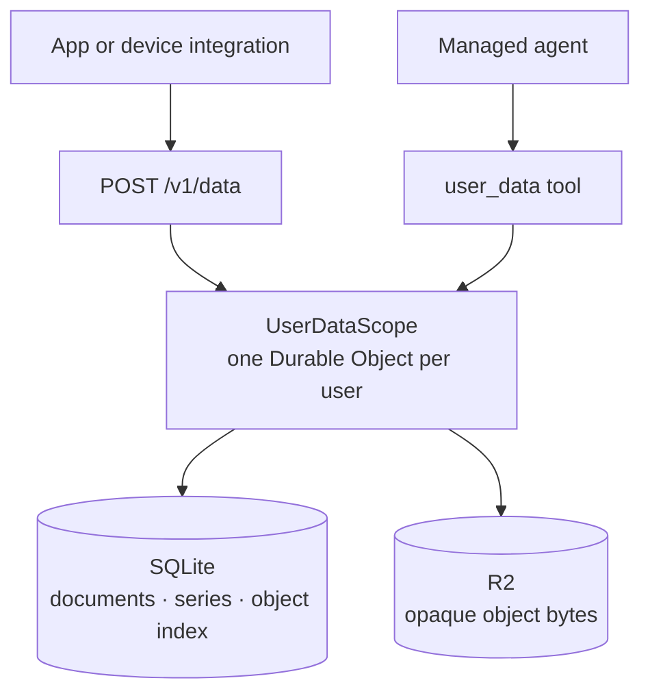

# Per-user data

The managed Nanocodex service gives every account a private general-purpose data
store. The same closed operation contract is available through `POST /v1/data` and
the managed agent's `user_data` tool.



This deliberately is not raw D1 or R2 passthrough. A deployment-wide D1 database
would make every query responsible for an easy-to-miss tenant predicate. Naming one
SQLite-backed Durable Object from the authenticated user ID gives each user a real
transaction and storage boundary. R2 bodies share a bucket but use a server-derived,
hashed user prefix; callers never receive a bucket credential or physical R2 key.

## Data models

| Model | Operations | Intended use |
| --- | --- | --- |
| Documents | `document_put`, `document_get`, `document_list`, `document_delete` | Profiles, device configuration, integration state, structured records. |
| Time series | `timeseries_write`, `timeseries_list`, `timeseries_query`, `timeseries_aggregate` | Numeric telemetry with millisecond timestamps and optional JSON fields. |
| Objects | `object_put`, `object_get`, `object_list`, `object_delete` | Raw captures, exports, media, and other opaque UTF-8 or base64 payloads. |

Documents and objects receive monotonically increasing versions. Supplying
`if_version` makes an update or delete conditional, so a stale writer gets `409`
instead of overwriting a newer value. Identical puts are idempotent and leave the
version unchanged.

A time-series point is identified by `(series, timestamp_ms)`. Replaying an identical
point is idempotent. The default `conflict: "error"` preserves the existing point;
`"replace"` must be chosen explicitly. Queries are cursor-paged and can be bounded by
time. Aggregation supports `avg`, `min`, `max`, `sum`, and `count` over caller-chosen
buckets.

Object bytes are hashed again inside the user Durable Object. An optional caller
`sha256` is checked before the versioned metadata record is committed. JSON uploads
are currently bounded at 32 MiB decoded size; list/query pages default to 100 and
accept up to 1,000 entries, and one series write accepts up to 5,000 points.

## HTTP examples

An account API key uses the same bearer authentication as other managed routes:

```sh
curl https://nanocodex.gakonst.workers.dev/v1/data \
  -H "Authorization: Bearer $NANOCODEX_API_KEY" \
  -H 'Content-Type: application/json' \
  --data '{
    "operation":"document_put",
    "key":"com.example/device/profile",
    "value":{"model":"tracker-v1","worn_on":"left"}
  }'
```

```sh
curl https://nanocodex.gakonst.workers.dev/v1/data \
  -H "Authorization: Bearer $NANOCODEX_API_KEY" \
  -H 'Content-Type: application/json' \
  --data '{
    "operation":"timeseries_write",
    "series":"whoop.heart_rate_bpm.source.live",
    "points":[
      {"timestamp_ms":1789344000000,"value":72,"fields":{"device_id":"strap-1"}}
    ]
  }'
```

Read a time range or summarize it into five-minute averages:

```json
{"operation":"timeseries_query","series":"whoop.heart_rate_bpm.source.live","start_ms":1789344000000,"end_ms":1789430400000,"limit":1000}
```

```json
{"operation":"timeseries_aggregate","series":"whoop.heart_rate_bpm.source.live","start_ms":1789344000000,"end_ms":1789430400000,"bucket_ms":300000,"aggregation":"avg"}
```

The agent calls `user_data` with these exact JSON bodies. There is no separate model
translation layer, which keeps device integrations and agent behavior on one contract.

## Authorization and Connect

Reads require `data:read`; puts and deletes require `data:write`. Account API keys have
the owner's capabilities. Connect apps can request the exact resources
`urn:nanocodex:data:read` and `urn:nanocodex:data:write`; the broker binds the app and
grant identity before forwarding the operation.

Provider credentials remain in the credential broker. The data API and tool accept no
credential operation, and integrations should never put provider tokens into a
document, series field, or object. Pagination plus object reads is also the portable
export path: logical keys and content are exposed, while physical Durable Object IDs,
R2 keys, and broker secrets are not.

## WHOOP case study

[`gakonst/life`](https://github.com/gakonst/life) demonstrates a device integration.
Life first commits every phone upload to its own immutable gzip archive and SQLite
outbox. Its optional Nanocodex worker then:

1. verifies and uploads the raw gzip batch to
   `whoop/raw/<content-sha256>.json.gz`;
2. converts only Life's validated WHOOP metrics to integration-prefixed series;
3. retains decoder/source/device context as point fields; and
4. retries transient failures while using idempotent object and point identities.

Unknown packet fields stay in the raw object. A later decoder can derive a new named
series without rewriting the evidence it came from.
