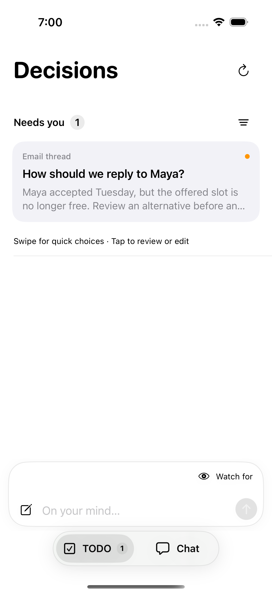
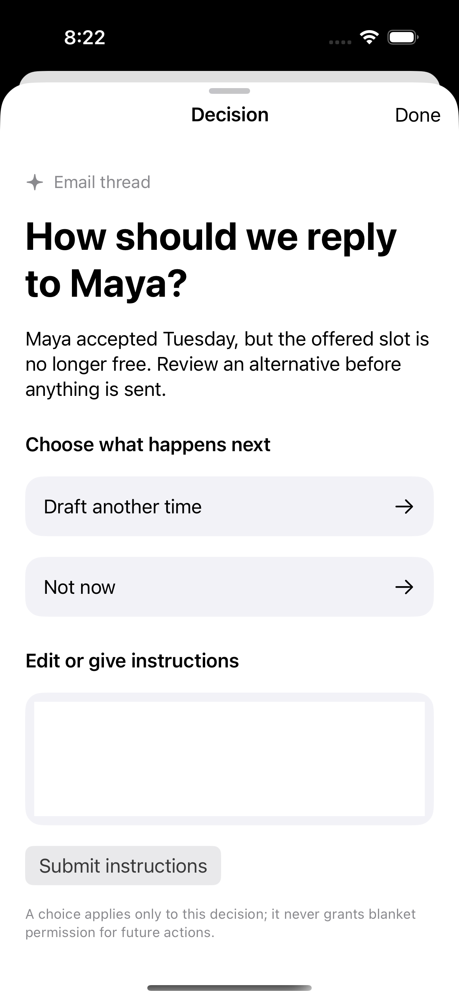
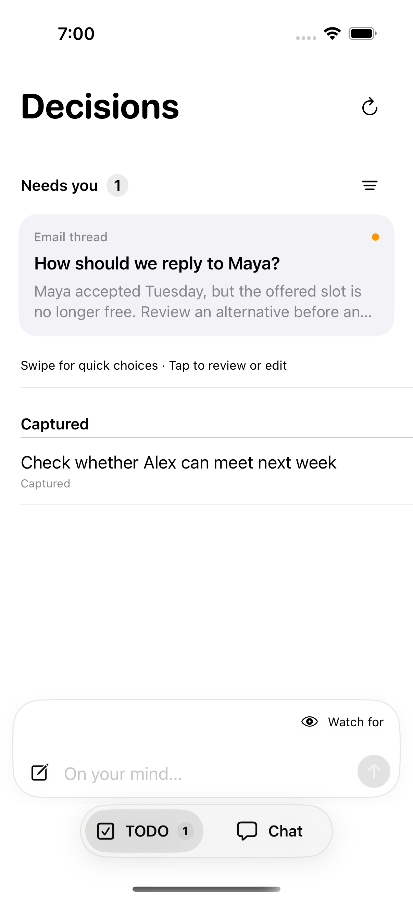
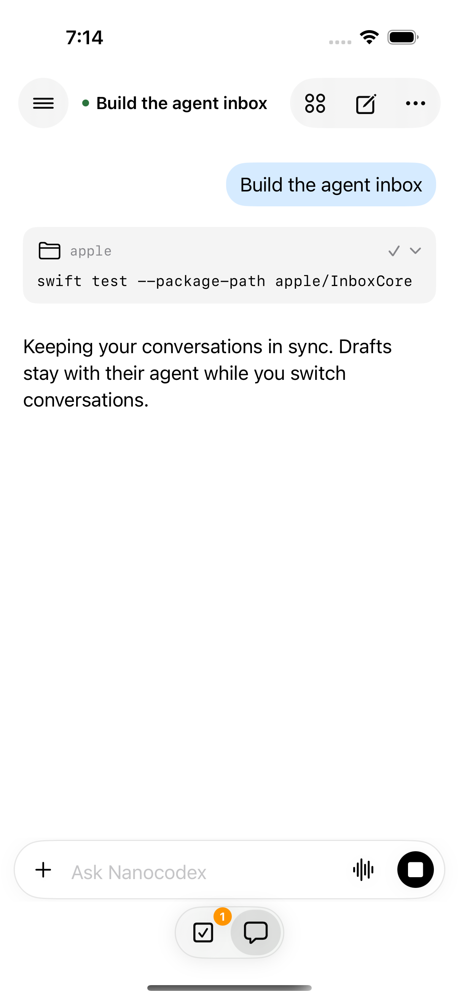
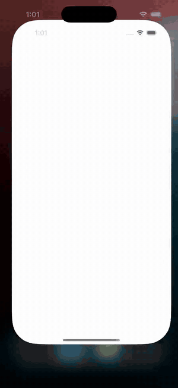

# Decision-first mobile TODO

The iPhone app opens the decision list for signed-in accounts. A compact “On your mind…” composer and the TODO/Chat switch share a pinned bottom dock; Chat’s composer stacks above the switch instead of overlapping it. Both modes use the same native growing text editor, shell, sizing, and send-button geometry; their controls differ only where the operation does (Chat model/attachments/voice vs. TODO watch trigger/save). Decision rows offer the first choice on a leading swipe and the second on a trailing swipe (tap the revealed button; a full swipe does not auto-approve). Tapping a card opens context, all choices, and free-text editing. TODO lists account-owned captures and decision proposals, keeps a local unsent draft while switching tabs, and refreshes while visible in the foreground. The app never synthesizes production decision cards; its sample email decision exists only behind the debug `--todo-ui-fixture` launch argument.

## Account API

`GET /v1/todo` returns `{items, decisions}` (up to 200 recent captures, 200 open decisions, and 200 recent non-open decisions; older records need pagination). `POST /v1/todo` accepts `{body, watch_hint, operation_id}` with a stable UUID; identical retries return the same saved item. A conflicting use of the same operation ID returns 409. A saved item starts as `captured`, not `watching`: no firehose consumer subscribes to it yet.

Trusted Worker code can call the account Durable Object `proposeTodoDecision({source_key,todo_id?,workflow_id?,title,context,source_label,source_url,choices})`. `source_key` deduplicates a producer's proposal within that account; `todo_id` links an existing capture, while `workflow_id` is a producer-owned correlation key. There is **no public decision-creation endpoint**. A decision may be `needs_you`, `answered`, `resolved`, or `stale`. `POST /v1/todo/decisions/{id}/respond` accepts `{version, choice_id, text, operation_id}` (exactly one choice or text) and records one versioned response idempotently. A successful response changes the decision to `answered`, not `resolved`. A changed version returns 409. The endpoint does not send email, create invites, or resume a workflow; a future producer/consumer must revalidate authority and take responsibility for side effects before marking `resolved`.

The API is authenticated to the user account. Connect grants and service callers are denied; GET requires `agents:read`, writes require `agents:write`, browser mutations require same origin. User data resides in the account's Durable Object SQLite, separate from conversation unread cursors. Capture responses are never interpreted as standing authorization. The client limits and retains its unsent text when the write fails.

## Remaining integration

The firehose → bounded Jev classifier → decision producer, workflow response consumer, push notification/deep link, capture monitoring status transitions, pagination, and server-side edit/archive controls are **not** present in this slice. Do not represent the current Gmail push wake or one-shot Jev model router as this pipeline. Any workflow consumer needs durable cursors, dedupe, exact action/version approval, stale-data checks, and explicit external-write outcomes.

## iPhone fixture preview

These images and the recording use `--demo --todo-ui-fixture`; names and email context are fictional. They do not show a live firehose, an executed email action, or a deployed phone build.

| Decisions | Review / edit | Captured | Chat dock |
| --- | --- | --- | --- |
|  |  |  |  |

[Watch the full-quality interaction recording](media/todo-mobile/walkthrough.mp4) · [Leading swipe](media/todo-mobile/swipe-primary.png) · [Trailing swipe](media/todo-mobile/swipe-secondary.png)
