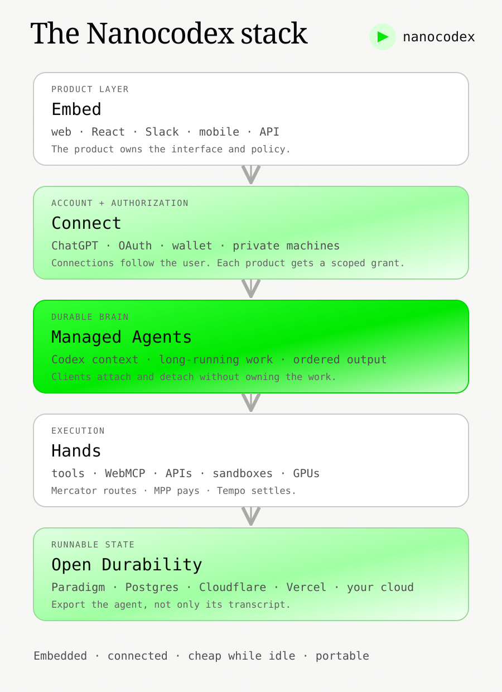
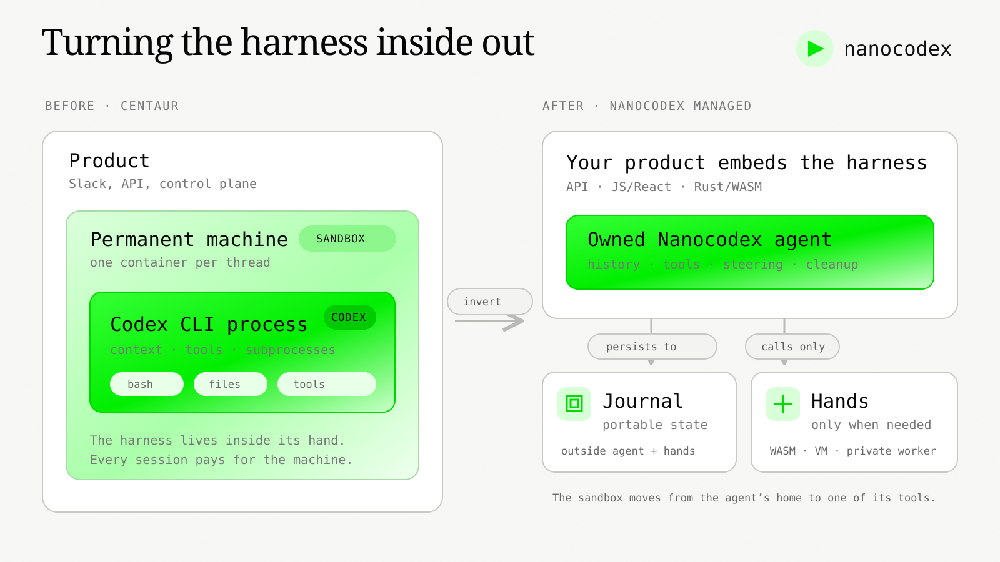
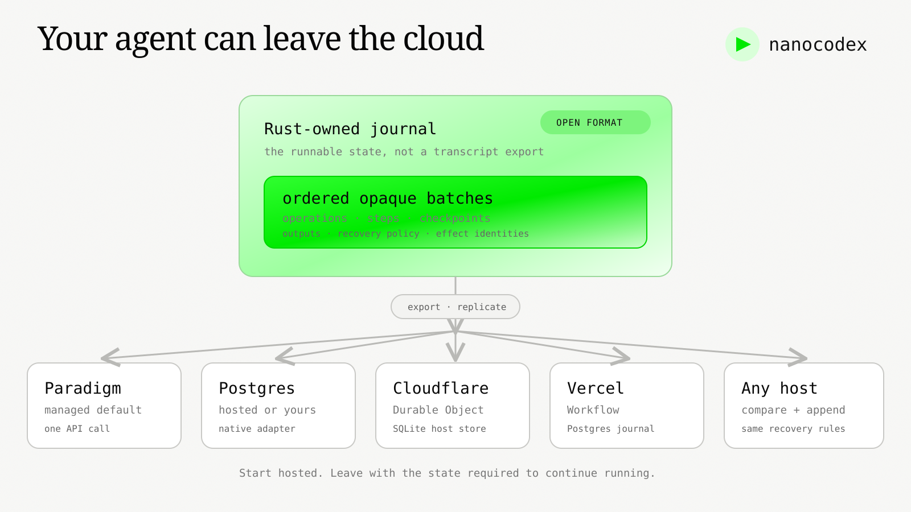

# Introducing Nanocodex: Managed Agents, Embedded Anywhere

*Create a durable Codex agent, connect it to a user’s accounts, and embed it in any product.*

By Georgios Konstantopoulos

Today we are launching **Nanocodex Managed**, Paradigm’s API for durable agents, and open sourcing [Nanocodex](https://github.com/gakonst/nanocodex), the agent runtime underneath it.

Managed Agents are long-running Codex agents you can create with an API call and put inside your own product. Connect lets a user bring their ChatGPT subscription and the accounts the agent should use. Your web app, Slack bot, mobile client, and background jobs can all attach to the same ordered output. They can leave and come back without stopping the work.

Paradigm operates identity, durable execution, event replay, secure egress, and sandbox lifecycle. You own the product and its policy. You can export the agent’s complete runnable state to Postgres, Cloudflare, Vercel, or another Nanocodex deployment at any time.



Here is the whole product loop:

```js
import { Agent } from "nanocodex/managed";

const managed = {
  baseUrl: "https://nanocodex.paradigm.xyz",
  apiKey: process.env.NANOCODEX_API_KEY,
};

const agent = await Agent.create(managed);
const turn = agent.turn.prompt({
  id: "migration-42",
  idempotencyKey: "customer-42:migration",
  input: "Inspect the repository and draft the migration PR.",
});

const result = await turn.result();
console.log(result.finalMessage);
```

In a browser, `Agent.create()` uses the current account session instead of exposing an API key. Before the first turn, the user can connect an eligible ChatGPT subscription for Codex model access and authorize GitHub, Slack, Google, or other tools through the same Connect flow. The product receives capability identities. The reusable credentials remain behind Paradigm’s broker.

## Attach, leave, and come back

An agent is not a request that happens to stream for a long time. It is a durable object with many possible observers.

Each output event has a cursor. A client attaches after a cursor, records the cursor only after it has rendered or persisted the event, and detaches by closing its iterator. That stops delivery to that client; it does not cancel the turn.

```js
let cursor = "latest";

// Attach this UI at the durable head.
let output = agent.events.watch({ cursor });
const rendering = (async () => {
  for await (const event of output) {
    render(event);
    cursor = event.cursor; // acknowledge only after render succeeds
  }
})();

// The tab closes or the user navigates away.
await output.return();     // detach this observer
await rendering;          // the durable turn keeps running

// A later client reopens the retained agent and resumes strictly after cursor.
const sameAgent = Agent.open(agent.id, managed);
output = sameAgent.events.watch({ cursor });
for await (const event of output) {
  render(event);
  cursor = event.cursor;
}
```

Network interruptions are resumed automatically by the SDK. `cursor: "0"` replays the complete retained history; `cursor: "latest"` attaches atomically at the current head. If the user actually wants to stop the work, cancellation is explicit: `await turn.cancel()`.

This distinction sounds small. It is what makes one agent usable from a web app, a Slack thread, a phone, and a background workflow without appointing any of them as the owner of the conversation.

<!-- PRODUCT VIDEO 01: 24 seconds, 16:9 and 4:5. Begin in a web product.
Create an agent, show the first durable cursors, click a visible “Detach” control,
and keep the server-side turn running. Open the same agent on a phone-sized
client, resume after the displayed cursor, and end on the completed artifact.
Capture the real SDK calls and API cursors from docs/launch/VIDEO_STORYBOARDS.md. -->

## Agents are becoming embedded infrastructure

Wallets went through a similar transition. They began as separate destinations: install an extension, leave the application, manage another account, and return. Embedded-wallet infrastructure made the wallet a native product primitive. The application could own the experience while a specialized system handled key management and authorization. Newer systems also let users bring the same wallet across applications instead of creating a fresh identity each time ([Privy](https://privy.io/blog/embedded-wallet-launch), [global wallets](https://privy.io/blog/global-embedded-wallets)).

Agents are moving the same way.

The first generation lives in a terminal or a dedicated chat application. The next generation will be inside the software where the work begins: an IDE, an investment workflow, a support console, a research product, a multiplayer document, or something we have not named yet. The product should own the interface and policy. The agent should arrive with a durable identity, connected capabilities, and work that survives the interface.

The analogy has one important consequence: embedded should not mean captive. A user should be able to bring an agent into a product, and a developer should be able to take its runnable state back out. This is why Connect and the interoperable durability format are product features, not implementation details.

Nanocodex Managed is the hosted primitive. Nanocodex is the open runtime and exit path.

Underneath both is one architectural move: **turn the agent harness inside out**.



## What Centaur taught us

Earlier this year, we [open sourced Centaur](https://www.paradigm.xyz/writing/open-sourcing-centaur-multiplayer-self-hosted-secure-agents), the shared agent we run at Paradigm and Tempo.

The core idea was almost embarrassingly simple: do not invent a fancy third-party agent harness. Run Codex.

Give the real harness a filesystem, bash, tools, skills, durable execution, and access to the organization. Put it where people already work. One Slack thread becomes one agent session; the agent can work for hours or days, survive restarts, and use real systems without seeing raw credentials.

This worked. Centaur transformed how we invest, research, recruit, design, and build. By the time we shipped [Centaur 2.0](https://www.paradigm.xyz/writing/centaur-2-0-permissions-context-and-mcp), more than 80% of sessions were happening in shared channels instead of DMs, and more than 99% of daily sessions completed successfully.

It also taught us where the architecture hit its limits.

Centaur ran the harness inside the sandbox. Every thread received a container with a full Linux environment and a CLI agent installed inside it. We then had to build the machinery around that process: spawn it, speak its process protocol, preserve its output, reconnect clients, checkpoint work, recover after crashes, manage subprocesses, expose remote tools, and keep credentials outside the container.

This was the right way to prove the product. It was also painful infrastructure to ask every agent developer to reproduce.

More importantly, it coupled three things with very different lifecycles:

1. **The agent**, which reasons, maintains context, calls tools, and should be cheap to start.
2. **Durability**, which records what happened and allows work to survive failures or move between machines.
3. **The execution environment**, which may be a local filesystem, a browser, a remote worker, or an expensive isolated VM.

A session that only needed to search, read files, or call an API still paid for a general-purpose sandbox. A tool that lived inside a private network needed the harness brought to it. A crash in the container could look like a crash in the harness. And the application was downstream of a CLI process boundary even though what it really wanted was a library.

Centaur was right about the harness and wrong about the boundary.

## Turning the harness inside out

Centaur’s architecture looked like this: the product controlled a sandbox, the sandbox contained a CLI harness, and the harness controlled the tools available inside that machine.

Nanocodex reverses the ownership. The product embeds the harness as a library. The harness owns the agent lifecycle, but it does not own a machine. Local tools, remote tools, browsers, and sandboxes are hands attached through narrow interfaces. The durable session is authoritative and lives independently of whichever process is currently reasoning or executing code.

The sandbox moves from being the agent’s home to being one of the agent’s tools.

This inversion changes the practical economics and reliability of managed agents. Inference can start without waiting for a machine. Simple work can stay in a cheap local or WASM environment. Expensive isolation can be provisioned only when needed. A failed sandbox can be replaced without losing the agent, and a failed harness can be reconstructed without nursing the sandbox back to health.

<!-- PRODUCT VIDEO 02: 20 seconds. Show a task beginning in Just Bash, a typed
native-capability requirement, the product attaching an isolated machine, and
the same turn continuing. -->

## The harness is part of the model

Developers often talk about a model as if the API weights determine agent performance on their own. In practice, the model and harness are one system.

Prompt shape, tool schemas, tool-result ordering, context compaction, cache identity, retry behavior, steering, subprocess cleanup, and dozens of other details determine whether the model can use its intelligence. A thin generic loop around the same model does not necessarily behave like Codex. Small differences compound over a long task.

This is why many agent SDKs underperform stock Codex or Claude Code. They replace a harness that is continuously co-developed with the model with a provider-agnostic abstraction, then attempt to win the performance back with more orchestration.

Nanocodex takes the opposite approach. We continuously inspect Codex, port the behavioral invariants that matter, and measure the result on complete agent workloads. Provider portability is explicitly not a goal. If a new Codex behavior improves the real harness, we evaluate and adopt it. Performance follows from parity, not from accumulating framework features.

Anthropic recently described a closely related conclusion in [Scaling Managed Agents](https://www.anthropic.com/engineering/managed-agents). Harness assumptions become stale as models improve, so Anthropic separated the session, harness, and sandbox behind small interfaces. The harness no longer lives inside the container; the container is simply another tool, provisioned only if the agent needs it. Anthropic reports that this reduced median time-to-first-token by roughly 60% and p95 by more than 90%.

We agree with the architecture. Nanocodex is our implementation of that thesis for the OpenAI agent stack: a small, faithful Codex loop embedded on the other side of the sandbox boundary, plus explicit seams for tools, durability, and execution.

## Under the hood

Nanocodex has three open layers. Managed composes them into the hosted product.

### 1. OpenAI API and tools

At the bottom is a typed implementation of the OpenAI Responses WebSocket API and the Codex tool environment.

Nanocodex owns persistent transports, retries, managed context, prompt-cache identity, pricing, and the complete streamed response lifecycle. Its tools layer includes Code Mode, shell sessions, process cleanup, MCP, deferred tool discovery, local tools, and remote dispatch.

Tools are capabilities supplied by the application. They can execute in the same process, over MCP, in a sandbox, or on a worker sitting behind a firewall. A remote worker can be called by the agent, or connect outward to Nanocodex when it cannot accept inbound traffic. The model sees the same typed tool either way.

This is the first important separation: **the agent does not need to live next to its hands.**

### 2. An owned agent lifecycle

Above the API is the agent.

One Nanocodex agent owns its conversation, ordered prompt queue, persistent WebSocket, tools, shell sessions, compaction, steering, cancellation, branching, and cleanup. Applications submit a prompt and receive an independently awaitable typed result. Ordered events are available for UIs, persistence, and observability, but consuming an event stream is not required for the turn to finish.

Only completed responses enter history. A partial failed response cannot execute a tool or become the base of the next turn. If a socket is replaced, Nanocodex can replay its complete client-owned typed history instead of depending on an opaque provider response ID.

Forking is a lifecycle primitive. An agent can start clean, fork from its latest committed state, or fork from an exact historical turn. Native and WASM applications use the same Rust implementation.

This is the second separation: **the agent is a library, not a process protocol.**

### 3. Pluggable durability

Durability is optional and lives above the agent rather than inside a specific application server.

`nanocodex-durability` provides an append-only journal, typed state reduction, operation deduplication, effect replay, recovery policy, and checkpoints. It ships with memory, SQLite, and Postgres stores. A platform can provide its own store by implementing atomic load and compare-and-append.

Rust owns the journal format and recovery decisions. The storage provider does not need to understand agent semantics, and the core agent does not need to understand the workflow platform hosting it.

The same durable agent can therefore run inside a normal server, a Cloudflare Durable Object, a Vercel Workflow, a Rivet Actor, or a system you build yourself. If a process disappears, another can reconstruct the committed state and continue. Managed agents become a deployment choice on top of the library, not a separate agent implementation.

This is the third separation: **durability is a property of the execution, not of the machine currently running it.**

## An interoperable durability format

Hosted agents should not become a new form of cloud lock-in.

Most durable systems expose an API but keep their execution history in a provider-specific internal database. You can download transcripts, but not the state required to resume the computation somewhere else. That is data export in the narrowest sense: you receive a record of what happened, while the provider retains the only runnable copy of the agent.

Nanocodex treats the durable journal as a public interoperability format.

The journal contains the ordered operations, committed agent history, checkpoints, effect identities, outputs, and recovery metadata needed to reconstruct the durable session. Storage adapters persist that same logical format; they do not redefine it. Memory, SQLite, Postgres, Cloudflare, Vercel, and the Paradigm-hosted service are different homes for the same state machine.

This gives every managed agent a credible exit:

- Export a complete portable snapshot from Paradigm and resume it against the open-source Postgres adapter.
- Point that adapter at Postgres you operate or at a hosted Postgres provider.
- Import the same journal into your own Cloudflare Durable Object, Vercel Workflow, Rivet Actor, or another compatible cloud.
- Follow an incremental cursor to continuously replicate durable state instead of waiting for a one-off migration.

The migration moves agent state, not Paradigm’s secrets. OAuth credentials remain in Connect and must be explicitly reauthorized or rebound at the destination. Tool and sandbox capabilities are resolved by stable identities, so the destination can attach equivalent local or remote resources without rewriting the historical journal.

Paradigm’s hosted product is therefore a convenience and operational commitment, not a custody claim over the agent. Start with one API call, leave with a complete runnable history.

## How Managed composes the pieces

Once the harness, session, and hands have independent lifecycles, a managed agent service becomes surprisingly small. Nanocodex Managed is the complete hosted version operated by Paradigm.

The hosted API exposes the durable lifecycle rather than a sandbox process: create or reuse an agent, append input, execute or steer a turn, and stream ordered events. The same agent can be attached to a web app, React interface, Slack thread, mobile client, background workflow, or several of them at once. Closing one client does not stop the work.

The API is intentionally ordinary. Create an agent with an idempotency key, submit a stable turn, and consume server-sent events from a durable cursor:

```bash
curl -X POST \
  -H "Authorization: Bearer $NANOCODEX_API_KEY" \
  -H 'Idempotency-Key: create-project-42' \
  https://nanocodex.paradigm.xyz/v1/agents

curl -X POST \
  -H "Authorization: Bearer $NANOCODEX_API_KEY" \
  -H 'Content-Type: application/json' \
  -H 'Idempotency-Key: request-42' \
  --data '{"id":"turn-42","input":"Inspect the repository and draft the migration."}' \
  https://nanocodex.paradigm.xyz/v1/agents/<agent-id>/turns

curl -N \
  -H "Authorization: Bearer $NANOCODEX_API_KEY" \
  'https://nanocodex.paradigm.xyz/v1/agents/<agent-id>/events?cursor=0'
```

If the create or turn response is lost, retry the same identity. If the client disconnects after cursor 42, reconnect after 42. Neither recovery path asks the application to reconstruct model history or guess whether the work was accepted.

Paradigm owns identity, quotas, durable storage, event replay, client synchronization, execution routing, and sandbox policy. Nanocodex owns the agent. Tools can remain wherever the data or compute already lives. A sandbox is allocated only when the agent actually needs a real machine.

Most work does not begin by compiling Chromium or building a Linux kernel. For common shell and file operations, Nanocodex can run against a lightweight WASM workspace with a persistent filesystem and lazy bash-compatible tools. If the task requires a system package, native binary, browser, GPU, or stronger isolation, the application can attach a container or VM as another hand.

This makes the cost model proportional to the work. The agent starts reasoning immediately inside the Rust/WASM runtime. Common filesystem and bash operations run against the lightweight workspace. When those tools return a typed capability error—for example because the task needs a native package, a browser, more compute, a GPU, or stronger isolation—the control plane attaches the appropriate remote environment and the agent continues there. You pay for a real sandbox only when the work needs one, and retain it only while it remains useful.

**Connect** extends the same idea to identity. A product can embed one connection flow and let a user reuse the accounts they have already connected through Paradigm. Credentials remain outside the agent and its sandbox; an egress broker authorizes each request and injects the right OAuth token or secret at the network boundary. The application gets useful tools without distributing credentials into generated code or rebuilding GitHub, Slack, Google, and every other OAuth integration for every surface.

That includes the model itself. A user can connect an eligible ChatGPT subscription and use it for Codex model access without giving the product an OpenAI API key. They complete OpenAI's device authorization once; Paradigm's broker stores and refreshes the account credential, then injects current access only when it opens the fixed Codex WebSocket. The application, harness, generated code, and sandbox receive no reusable ChatGPT credential. Users can disconnect it at any time, and use remains subject to their OpenAI plan, limits, and terms.

The result is an agent account that can travel between applications while preserving the user’s explicit grants. The same connected GitHub, Slack, Google Drive, or Linear capability can be used from a web app, a Slack thread, a mobile client, or a long-running background agent under the same policy. A developer embeds Connect once; the user brings their accounts and permissions with them.

<!-- PRODUCT VIDEO 03: 30 seconds. Show the embedded Connect flow, a user
authorizing ChatGPT for model access and GitHub for one tool capability, the
product receiving capability identities only, and the agent opening a pull
request through brokered egress. Never display a token or imply that an API key
grants all of a user's connectors. -->

Tools work in both directions. A hosted agent can call tools exposed over HTTPS or MCP. A local or private worker that cannot accept inbound traffic can establish an outbound connection and register its capabilities with the agent. This lets Nanocodex Managed operate against a laptop, VPC, private cluster, or physical device without moving the harness or exposing the worker to the public internet.

The managed product uses Paradigm’s hosted durability and execution network by default. The underlying durability contract and export format remain open, so teams that need to own their database or runtime can move the same agent to SQLite, Postgres, a Cloudflare Durable Object, a Vercel Workflow, or a host-provided store. Hosted and self-hosted are deployment choices around one agent contract, not separate products with different behavior.



<!-- PRODUCT VIDEO 04: 28 seconds. Export a consistent hosted snapshot, import
it into Postgres or a Vercel/Cloudflare adapter, fence the source, reauthorize
the connector, and resume the same thread. Record the real API flow, not a
conceptual animation. -->

## WASM is the portability layer

Nanocodex is written in Rust and the agent itself is WASM-compatible.

This matters because WASM gives us a small, deterministic unit that can run in a browser Worker, an edge isolate, a server, or next to a customer’s infrastructure without changing the agent lifecycle. JavaScript owns the host-specific pieces—WebSocket creation, credentials, UI, persistence, and application tools—while Rust continues to own ordering, history, tool calls, branching, snapshots, and cleanup.

We have reference consumers running the same agent contract in:

- native Rust, Node, and Python applications;
- a browser with an OPFS workspace and no server-side sandbox;
- Cloudflare Workers and Durable Objects;
- Rivet Actors;
- Vercel Workflows and Sandboxes;
- retained libkrun VMs; and
- remote exe.dev machines.

These were our deployment proofs for the hosted product. Nanocodex Managed can route work across the execution environments Paradigm operates while preserving one durable agent and event stream. The open-source adapters remain available for teams that want to run the same architecture themselves.

## Performance should disappear

An agent library should not be the bottleneck in an agent.

On a retained 70-turn workload with three forks, 97.879% of wall time was model time and median Nanocodex overhead was 0.267 milliseconds. Across a retained 41-task workload with 503 model calls, 892 tool calls, and more than 81,000 API events, model generation and requested tool work accounted for 99.864% of summed wall time.

Historical forks reused provider checkpoints with a 99.6% prompt-cache hit rate and sent 97.4% less request data than full replay. A retained VM tool call added hundreds of microseconds rather than paying VM boot on every command.

These numbers are not the thesis. They are evidence that the abstraction gets out of the way.

The real performance goal is Codex parity: preserve the behavior and context the model expects, remain model-latency bound, and do not force every application through a sandbox or framework protocol it does not need.

## What Nanocodex is not

Nanocodex is intentionally narrow.

The open-source SDK is not a provider abstraction, app server, or generic JSON-RPC agent daemon. It does not ask you to adopt its UI, sandbox vendor, database, or workflow platform.

Nanocodex Managed is intentionally more opinionated: it is the hosted control plane, API, durability, Connect identity, secure egress, and execution network built on those primitives. Using it should remove infrastructure decisions, not leak them into your application—or prevent you from leaving with the runnable state of your agents.

The shared contract is the embeddable agent lifecycle. The hosted API, CLI, TUI, React hooks, browser workspace, durable actors, VMs, voice client, and evaluation harness are consumers of that contract rather than alternate agent implementations.

We expect models and their harnesses to keep changing quickly. The stable primitives around them should be smaller: typed model I/O, tools, an owned agent, a durable journal, and explicit execution boundaries.

## Available today

Nanocodex is open source under Apache 2.0 or MIT. Nanocodex Managed is available from Paradigm as a hosted API.

Install the Rust crate:

```bash
cargo add nanocodex
```

Or the Node package:

```bash
npm install nanocodex
```

You can also try the native CLI:

```bash
curl -fsSL https://nanocodex.paradigm.xyz | bash
nanocodex
```

The code, examples, deployment proofs, and retained benchmarks are available on [GitHub](https://github.com/gakonst/nanocodex). You can create a managed agent, connect accounts, and get API credentials at [nanocodex.paradigm.xyz](https://nanocodex.paradigm.xyz).

Centaur showed us that a frontier harness, durable execution, shared tools, and secretless access could turn a personal coding agent into organizational infrastructure. Nanocodex turns that architecture inside out. Nanocodex Managed makes the complete system an API.

We cannot wait to see what you build.

---

## Launch post for X

Announcing Nanocodex Managed: durable Codex agents you can embed in any product, with Nanocodex as the open-source Rust/WASM runtime underneath.

Create an agent over the API. Connect a user’s ChatGPT subscription and tools. Attach its output to web, Slack, mobile, or several clients at once. Detach and the work continues; reattach after the last durable cursor and nothing is lost.

Agents are following the path of embedded wallets: moving from a separate destination into the products where people already work. The product should own the experience. The agent should bring durable state and explicit capabilities. Embedded should not mean captive.

That product came from what we learned building Centaur.

Centaur proved the core idea: don’t build a fancy 3p harness. Just run Codex, give it tools + durability + secure access to your company, and put it where people work.

It transformed how Paradigm and Tempo operate. But the setup was painful: the harness lived inside a sandbox, every session paid for a container, and we had to rebuild process control, replay, recovery, remote tools, and secret handling around a CLI.

Centaur was right about the harness and wrong about the boundary.

Nanocodex turns the harness inside out.

Instead of product → sandbox → CLI harness → tools, your product embeds the Codex loop directly. Sandboxes and remote workers sit outside it as hands. Durable state sits outside both.

So we unbundled it:

- typed OpenAI API + Codex tools
- an owned agent lifecycle
- pluggable durability
- local or remote hands
- native + WASM

And Paradigm is hosting the full stack.

Create an agent over the API. Attach it to your app with JS/React, Slack, mobile, or your own client. Disconnect and it keeps working. Reconnect from somewhere else and resume the same durable event stream.

The agent starts in the lightweight Rust/WASM environment. A sandbox is just another tool, provisioned only when bash/filesystem emulation is not enough. Local and private workers can connect outward and register tools without exposing themselves publicly.

Connect lets users bring the accounts they already linked. OAuth tokens and secrets never enter the agent or sandbox; Paradigm injects them at the egress boundary under the user’s grants.

The durability format is interoperable. Export the complete runnable journal from Paradigm and resume on your own Postgres, hosted Postgres, Cloudflare Durable Object, Vercel Workflow, Rivet Actor, or another Nanocodex deployment. You can also follow an incremental cursor and replicate continuously.

The hosted product is a convenience, not lock-in. Start with one API call; leave with the state required to keep running.

This is also where Anthropic landed with Managed Agents: separate the session, harness, and sandbox; keep credentials outside the execution environment; connect the brain to the hands only when needed.

Nanocodex is that architecture for the OpenAI stack, with Codex parity as the performance strategy.

Build locally with Nanocodex. Run durable agents on Paradigm without operating the machinery Centaur taught us to build.

Apache/MIT. Rust, JS/WASM, and Python.

GitHub: https://github.com/gakonst/nanocodex

Managed: https://nanocodex.paradigm.xyz
