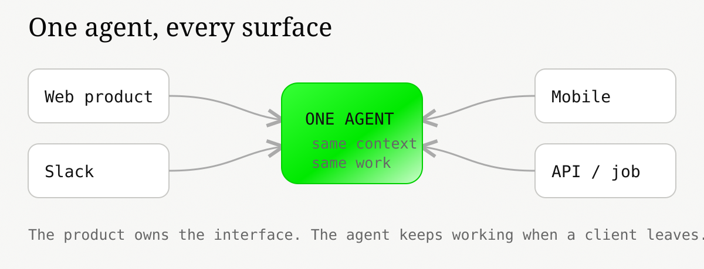
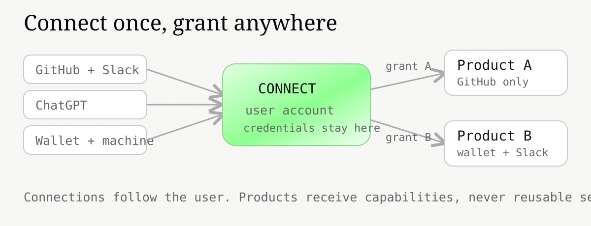
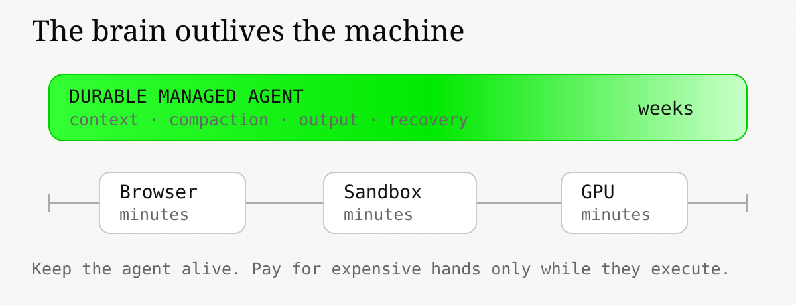
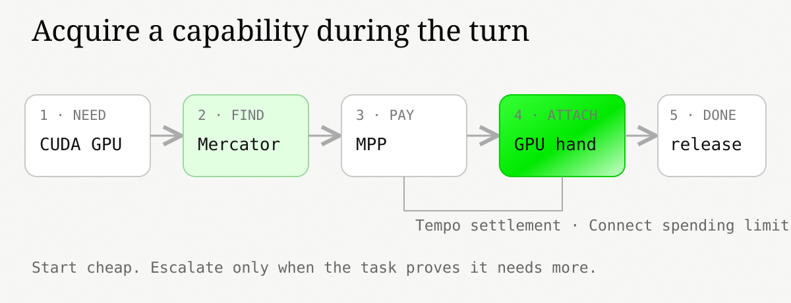
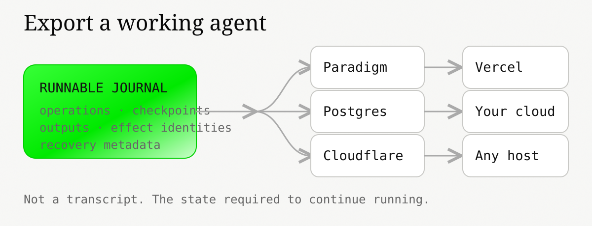
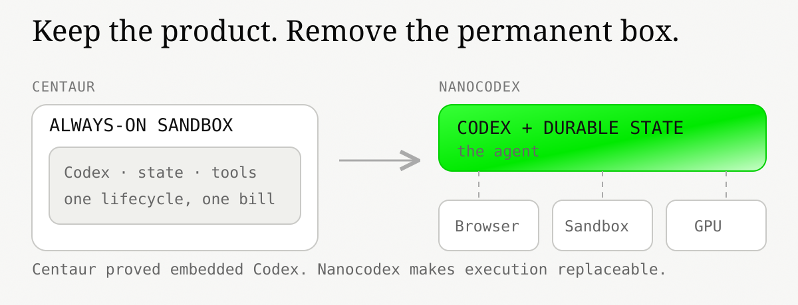

# Introducing Nanocodex

*Managed Codex agents you can embed in any product.*

By Georgios Konstantopoulos

Today we are releasing Nanocodex Managed, Connect, and the open-source Nanocodex runtime.

You should use Nanocodex if you want to put a Codex agent inside your product without running one container per user, rebuilding OAuth for every integration, or trapping the agent on our cloud.

The product has four properties:

1. **Embed.** The agent runs inside your product. The same agent can appear in a browser, Slack, mobile, or an API.
2. **Connect.** The user's ChatGPT subscription, accounts, wallet, and machines follow the user. Each product gets an explicit grant, not the underlying credential.
3. **Hands.** The agent is durable without owning a permanent machine. It attaches a browser, sandbox, GPU, API, or private worker when it needs one, and you pay for that resource while it is attached.
4. **Open Durability.** You can export the runnable agent—not just its transcript—and resume it on Postgres, Cloudflare, Vercel, another Nanocodex deployment, or infrastructure you operate.

These are one stack: **Embed → Connect → Managed Agents → Hands → Open Durability.**

## Embed: the agent belongs in the product

Most agents still make the user go somewhere else. Open a terminal. Open a chat app. Copy the context over. Wait there for the answer.

That is the wrong boundary for most software.

Nanocodex exposes the same running agent through JavaScript, React, and HTTP. A product can render it beside the work it is doing. This could be a support ticket, research document, editor, or transaction flow. Slack, mobile, and background jobs can attach to the same agent. Closing one client does not stop the work.



Embedding also gives the agent a better way to use the product. The application can expose its own functions as local tools. A browser can expose the current page through WebMCP. The agent acts on the product's real state instead of scraping a UI or moving all of the data into a remote sandbox.

This is the same transition wallets made. Wallets started as destinations. Then they became infrastructure embedded inside applications. Agents are going through the same transition, except they also need durable work, connected accounts, and replaceable execution.

## Connect: accounts should follow the user

Embedding an agent is easy until it needs to do anything useful.

Then every product asks the user to connect GitHub, Slack, Google, Linear, a wallet, a model account, and sometimes a machine. The OAuth work is repeated by every developer. The user repeats setup in every product. Credentials end up copied into application databases and sandboxes.

Connect gives the user one portable capability graph.

A connection belongs to the user's Nanocodex account, not to one product or one agent. When the user opens another Nanocodex-powered product, the connection is already there. The new product asks for a scoped grant covering the tools, data, output, and optional spending authority it needs.



The product can keep Auth0, Better Auth, Privy, or whatever it already uses for login. Connect links that authenticated user to a Nanocodex account. It is an authorization layer for agents, not a demand to replace the application's identity system.

The application, generated code, agent, and sandbox receive capabilities. They never receive OAuth refresh tokens, SSH private keys, or wallet secrets. Our egress service checks the grant and injects the credential at the network boundary. Revoking the connection takes effect without hunting for copies on running machines.

ChatGPT works the same way. A user can connect an eligible ChatGPT subscription and let Nanocodex run Codex without giving the embedding application an OpenAI API key. Usage remains subject to the user's OpenAI plan, limits, and terms.

The important property is simple: connect GitHub once, then explicitly grant GitHub wherever your agent appears.

## Managed Agents: keep the brain, attach the hands

A long-running agent and a Linux container are not the same thing.

The agent owns the Codex context, prompt queue, compaction, tool calls, steering, cancellation, branching, and committed output. That state should survive a browser closing, a process restarting, or a sandbox disappearing.

The machine is a hand. It exists to execute work.



Most managed-agent systems allocate a container first and put the agent inside it. The container then sits there while the model reasons, waits for the user, calls an API, or does nothing. Keeping the agent alive means keeping the machine alive.

Nanocodex keeps the agent durable without keeping an idle VM. Common filesystem, shell, API, and product-local work runs in the Rust or WASM runtime. If the turn needs a native binary, a real browser, stronger isolation, more compute, or a GPU, Nanocodex attaches that resource and retains it only while useful.

The agent can live for weeks. The expensive machine can live for minutes.

[Anthropic calls this separating the brain from the hands](https://www.anthropic.com/engineering/managed-agents). We agree. In Nanocodex, the hands can also be functions inside the embedding product, OAuth-backed APIs behind Connect, browsers, reverse-connected laptops, or workers inside a private network.

Durability also means clients do not own the work. The normal API is intentionally boring:

```js
const agent = await Agent.create();
const turn = agent.turn.prompt({ input: "Prepare the migration PR." });
```

Output is an ordered event log. A client stores the last cursor it processed, detaches by closing its watcher, and reattaches later—even from another process:

```js
let cursor = "latest";
let output = agent.events.watch({ cursor });
const rendering = (async () => {
  for await (const event of output) {
    render(event);
    cursor = event.cursor;
  }
})();

await output.return(); // detaches this client; the turn keeps running
await rendering;

const sameAgent = Agent.open(agent.id);
output = sameAgent.events.watch({ cursor });
```

Applications do not replay transcripts on the common path. They also do not invent an `idempotencyKey` for every prompt. The SDK creates the identities it needs. Applications coordinating retries across separate processes can opt into explicit turn identities.

## Capabilities: acquire the right hand when needed

We use *capability* to mean anything the agent can call: a function in the product, an OAuth-backed API, a browser, a sandbox, a GPU, a private worker, a dataset, or a specialized service.

Capabilities do not have to run beside the agent. A laptop inside a private network can connect outward and register tools without accepting inbound traffic. A browser can expose the current product. A sandbox can appear for one task and disappear after its filesystem is committed.



Connect decides what the agent may use. Mercator discovers and routes eligible providers. The [Machine Payments Protocol](https://tempo.xyz/solutions/agentic-payments/), co-authored by Stripe and Tempo, negotiates and meters payment when a capability costs money. Payment can settle on Tempo under the spending limit the user approved in Connect.

This lets an agent escalate during a turn. Start in the cheap WASM runtime. Discover that the task needs Chrome, CUDA, or a machine inside the user's network. Find an eligible provider. Pay for exactly that capability. Attach it. Release it when the work is done.

The reverse also works. A developer can expose an underused machine or specialized service, set a policy and price, and let eligible agents find it. The agent needs a typed capability, a grant, and a route. It does not need to know which cloud owns the machine.

## Open Durability: the agent can leave

Hosted agents should not become another form of cloud lock-in.

A transcript export is not enough. It tells you what the agent said. It does not contain the information required to resume an interrupted tool call, recover committed output, preserve compaction, or continue from the same agent state.

Nanocodex exports the journal the agent actually runs from. It contains ordered operations, committed history, checkpoints, effect identities, outputs, and recovery metadata.



The open-source durability library defines the journal and the rules for reducing it into agent state. An adapter only has to implement atomic load and compare-and-append. The same format can live in SQLite, Postgres, a Cloudflare Durable Object, a Vercel Workflow, or Paradigm's hosted service.

This is plumbing. It is also the difference between exporting a chat log and exporting a working agent.

A team can start on Nanocodex Managed, export a consistent snapshot, and resume against its own Postgres. It can follow an incremental cursor and replicate before a migration. It can move to Cloudflare, Vercel, or another Nanocodex host without translating the agent's state into a new proprietary workflow model.

Secrets do not move with the journal. The destination reauthorizes Connect and binds the tools and compute it intends to use. Durable state is portable. Credentials remain scoped and revocable.

Paradigm will run the default hosted service because most developers should not have to operate this machinery. The open format exists so that using our service never gives us the only runnable copy.

## What Centaur proved

We learned this by operating [Centaur](https://www.paradigm.xyz/writing/open-sourcing-centaur-multiplayer-self-hosted-secure-agents) across Paradigm and Tempo.

Centaur made one decision that mattered: use Codex directly instead of replacing it with a third-party harness. Put it in Slack, let it run for hours or days, connect it to real company systems, and make the sessions multiplayer. By [Centaur 2.0](https://www.paradigm.xyz/writing/centaur-2-0-permissions-context-and-mcp), more than 80% of sessions happened in shared channels and more than 99% of daily sessions completed successfully.

This worked. It also showed us where the architecture stopped scaling.



Centaur put the agent, its state, and its tools inside a sandbox. We then built supervision, recovery, remote tool transport, credential brokering, and sandbox lifecycle around that box. Even a task that only needed an API call paid for a general-purpose machine.

Nanocodex turns that boundary inside out. Codex and its durable state are the agent. Everything else is a capability that can be attached where it already lives.

Centaur proved the product. Nanocodex is the version we can embed everywhere and operate at the cost of the work it actually performs.

## Available today

Nanocodex is open source under Apache 2.0 or MIT. It includes the Rust agent, JavaScript and Python bindings, the WASM runtime, tools, durability adapters, and deployment examples.

Nanocodex Managed provides the hosted agent API, Connect, durable storage, secure egress, capability routing, and sandbox lifecycle. Mercator and MPP let agents discover and pay for additional capabilities under user-approved limits, with Tempo available as the settlement rail.

Put the agent in your product. Let the user bring their accounts. Pay for hands when the work needs them. Export the agent if you want to run it somewhere else.

Code and documentation are available on [GitHub](https://github.com/gakonst/nanocodex).
