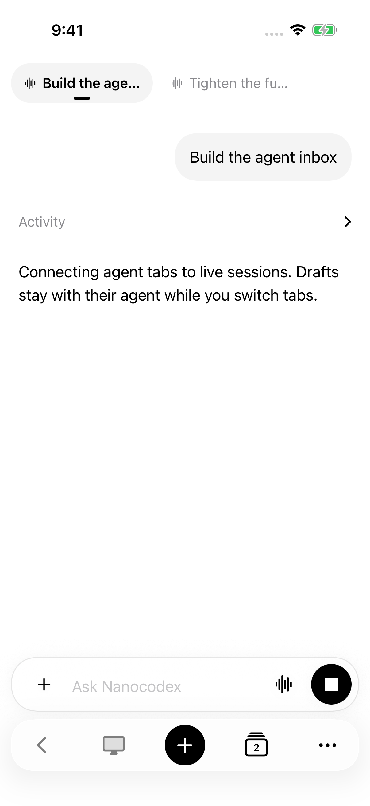
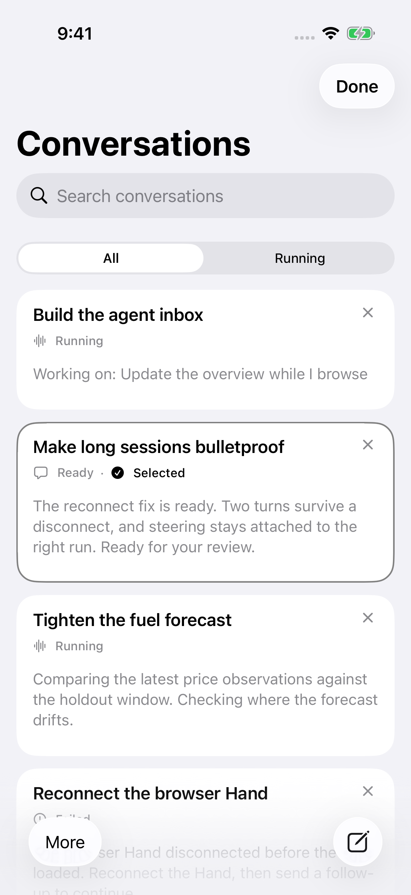
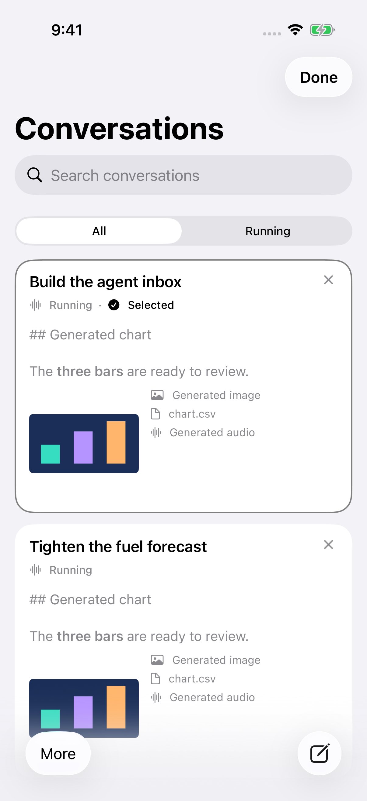
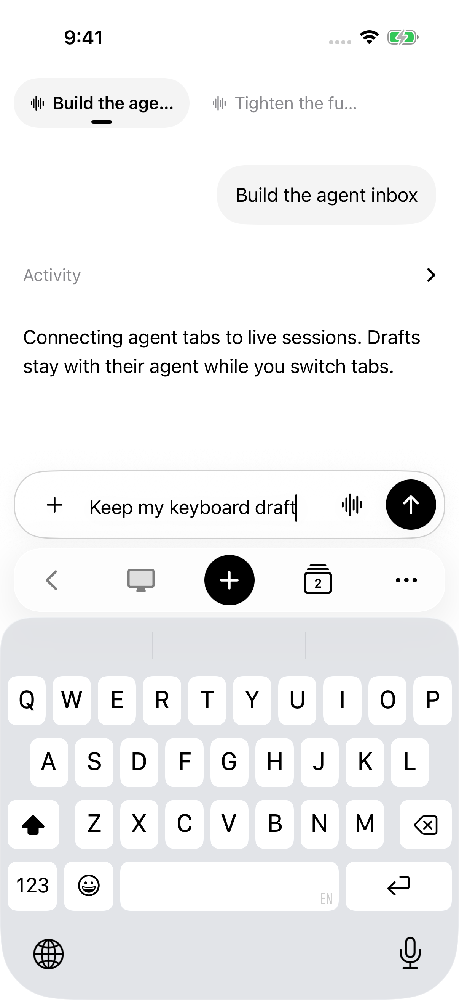
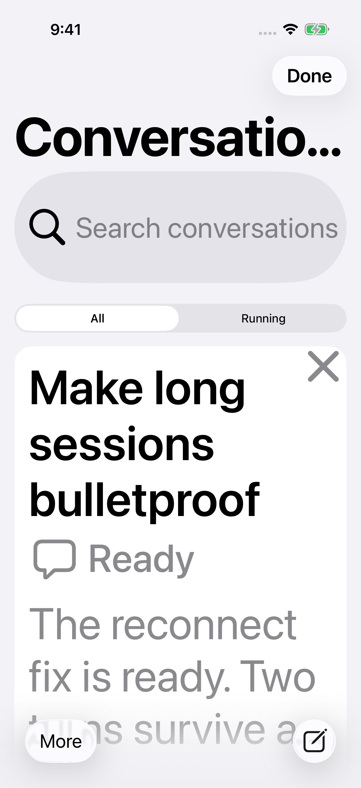
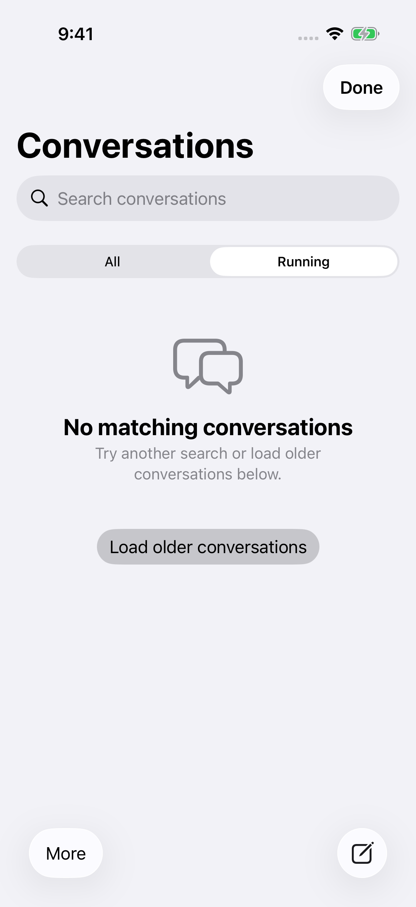
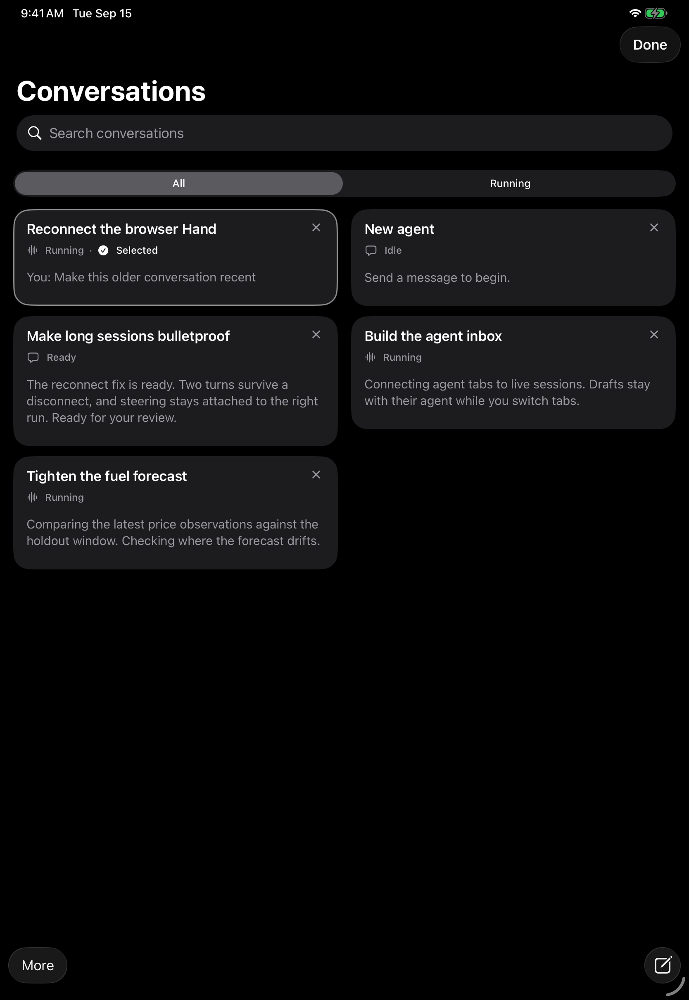
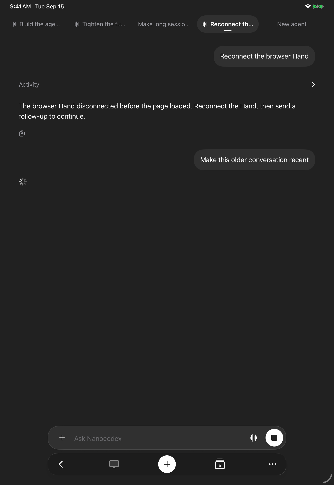
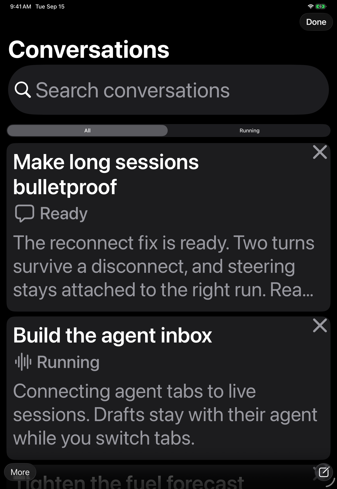

# Mobile conversation design

This pass makes the current conversation easier to identify and the overview
easier to scan. It keeps the existing tab, draft, queue, voice, and screen flows.

## Design

- A filled capsule, underline, and stronger title identify the selected tab.
  A waveform identifies running work.
- One floating toolbar contains navigation actions. New conversation is prominent.
- The overview uses readable excerpts, explicit status labels, selected checkmarks,
  and attachment thumbnails with file labels.
- iPhone uses one column. iPad uses top-aligned adaptive columns. Accessibility
  text sizes use one column and allow complete conversation titles to wrap.
- System colors, reduced-motion behavior, and the reduced-transparency fallback
  remain available. Liquid Glass is limited to the controls.

These choices follow Apple's guidance on [design foundations](https://developer.apple.com/videos/play/wwdc2025/359/),
[materials](https://developer.apple.com/design/human-interface-guidelines/materials),
and [accessibility](https://developer.apple.com/design/human-interface-guidelines/accessibility).

## Evidence

Recordings and screenshots use the app's existing demo and startup fixtures on
an iPhone 17 Pro and an iPad Pro 11-inch, running iOS 26.5. They exercise the
native UI, including draft isolation, sending/stopping, keyboard placement,
search/filtering, live preview updates, closing/reopening tabs, generated media,
and menu destinations. The iPad recording uses dark appearance.

These are simulator journeys, not live-service, physical-microphone, or remote
desktop checks. The iOS 18 material fallback is compiled but not exercised here.

The recordings retain the complete test runs at normal speed. App relaunches
between tests are intentional. No audio is recorded.

### iPhone

[Complete recording (8m 19s)](iphone.mp4)

| Conversation | Overview | Generated media |
| --- | --- | --- |
|  |  |  |

| Keyboard and draft | Accessibility text | Empty filter |
| --- | --- | --- |
|  |  |  |

### iPad

[Complete recording](ipad.mp4)

| Dark overview | Conversation | Accessibility text |
| --- | --- | --- |
|  |  |  |

### Validation

The shared Rust voice core build and Xcode `build-for-testing` passed from the
isolated worktree. Ten iPhone UI tests passed with zero failures:

- `testBrowserBackRestoresDraftAndOverviewUsesLatestActivity`
- `testConversationTabsScaleWithAccessibilityText`
- `testCreateStopAndEmptyRunningFilter`
- `testGeneratedAttachmentsStayVisibleWhileInternalToolOutputStaysInActivity`
- `testInteractiveVoiceRequiresAccountAndPreservesTypedDraft`
- `testOverviewShowsLatestContentRunningStatusAndSelectsAgent`
- `testOverviewSwipeClosesLastTabAndCanReopen`
- `testPlusCreatesAgentAndMenuKeepsNavigationAccessible`
- `testTabDockStaysAboveKeyboardAndCreatesIndependentDraft`
- `testTabsWithoutDuplicateTitleAndCenteredCreateButton`

Tests use the `NanocodexInbox` scheme in `apple/NanocodexInbox.xcodeproj` with
`-parallel-testing-enabled NO`. Select individual cases with
`-only-testing:NanocodexInboxUITests/InboxUITests/<test-name>`.

Three iPad UI tests also passed with zero failures: browser-back/draft and live
overview ordering, accessibility text, and new-conversation/menu navigation.
The disposable iPad simulator needed a location-service restart during initial
OS migration; the recorded test run then completed successfully.

The screenshots were opened and inspected. Both recordings were opened in
QuickTime, with frames reviewed across each run.
