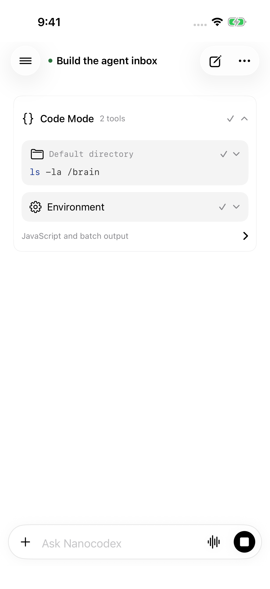
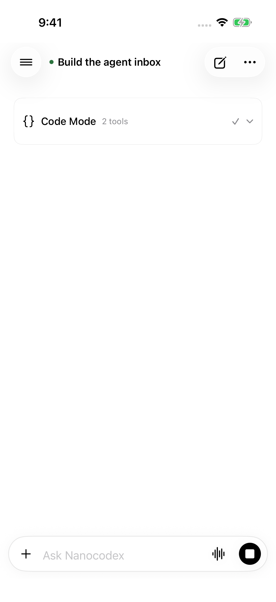
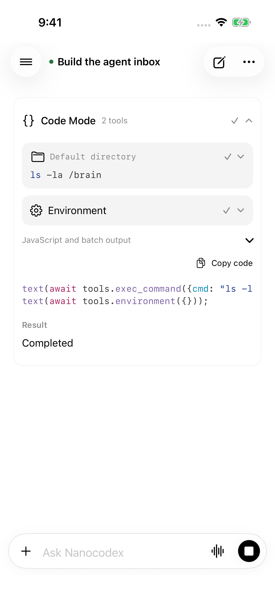

# Code Mode batches

Full NanocodexInbox app screenshots from an iPhone 17 Pro simulator running iOS 26.5, using the synthetic `NANOCODEX_DEMO_CODE_MODE_BATCH=1` fixture. The fixture does not execute any tools.

Captured by the passing `InboxUITests.testCodeModeBatchKeepsCommandsTogether` UI test. It verifies the default expanded state, each child appearing once, collapse hiding the children, and opening JavaScript details.

| Expanded by default | Collapsed | JavaScript details |
| --- | --- | --- |
|  |  |  |

The JavaScript screenshot uses lossless PNG recompression; no pixels were edited. The full app build used an existing local voice XCFramework with a matching public FFI header.
