# Project conversation component evidence

All media use simulator fixtures. They show real SwiftUI interaction; no capture
claims a live model response, project authorization flow or completed DJ Booth
application integration.

The **Nanocodex** presentation consumes the same composer, message, activity,
palette and navigation primitives as the mobile app. `NanocodexChatUI` supplies the
styled project content; `NanocodexChat` remains unstyled. Full-screen captures hide
the gallery picker. Attachment, voice and account actions remain host-owned; the
gallery supplies fixture controls.

## Native Nanocodex presentation

[Watch native composer, sidebar, attachments, expansion, bounded pending input and reply](nanocodex-native.mp4)

[Watch dark-mode presentation, composer and sidebar](nanocodex-dark.mp4)

| Light | Dark | Native composer |
| --- | --- | --- |
| 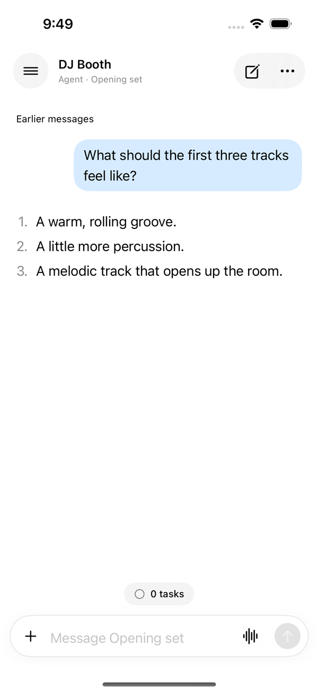 | 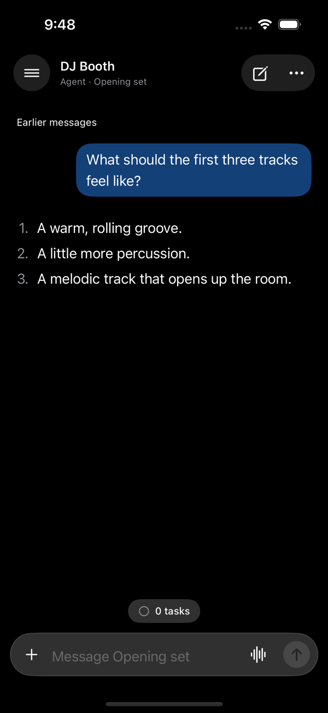 | 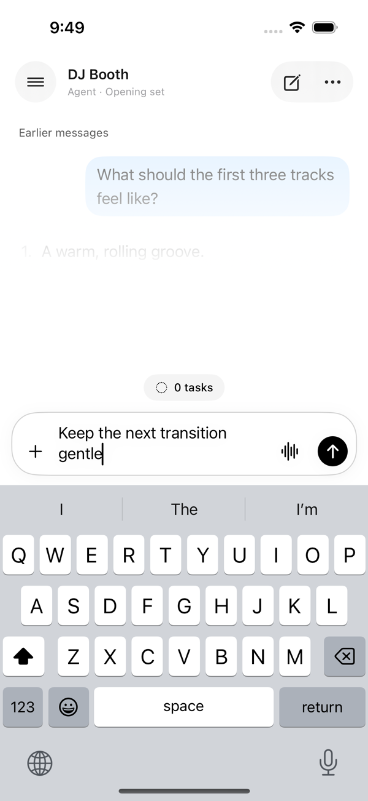 |

| Sidebar | Dark composer | Dark sidebar |
| --- | --- | --- |
| 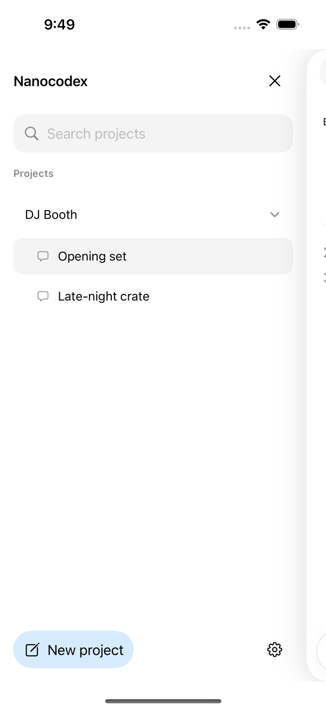 | 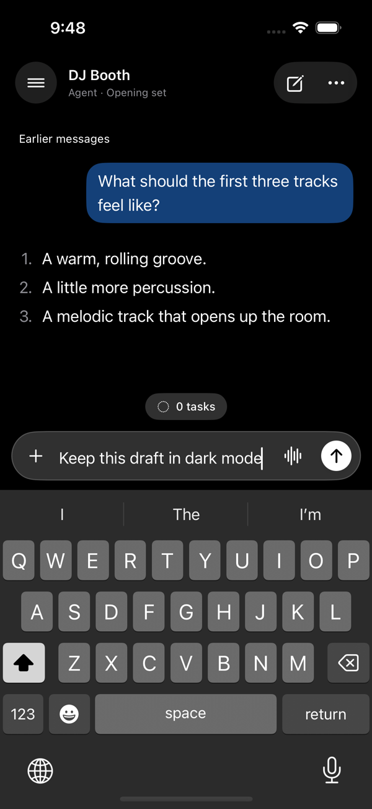 | 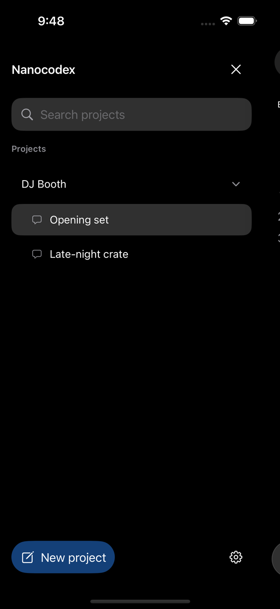 |

| Attachment menu | Expanded composer | Long pending input |
| --- | --- | --- |
| 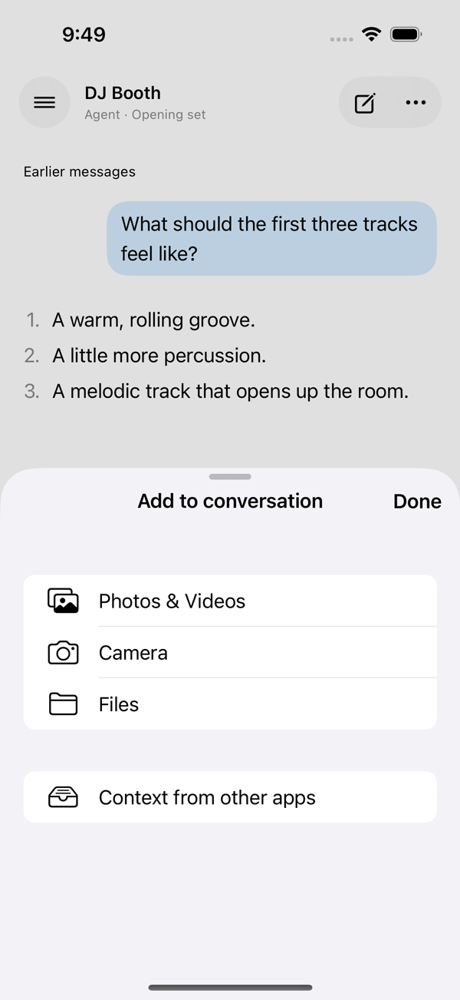 | 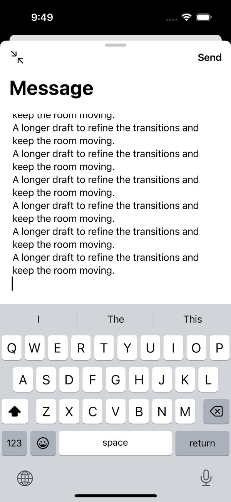 | 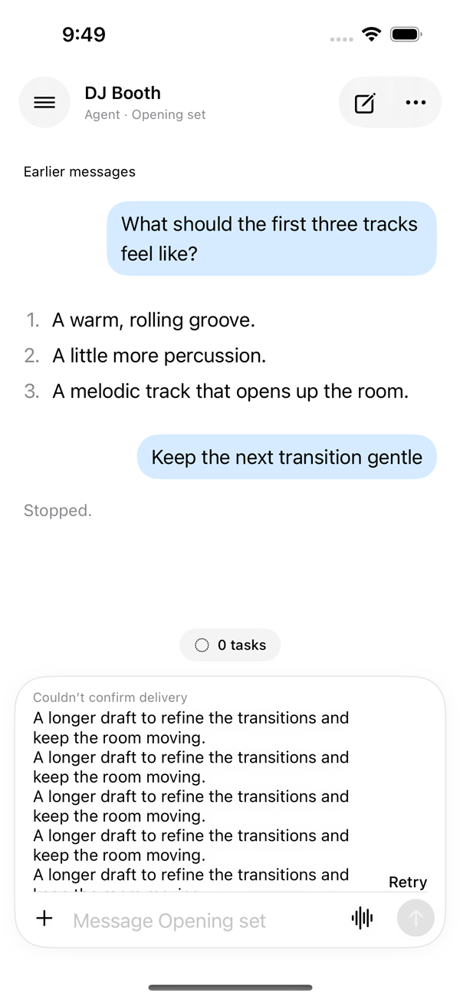 |

| Live turn | Stopped turn | Completed reply |
| --- | --- | --- |
| 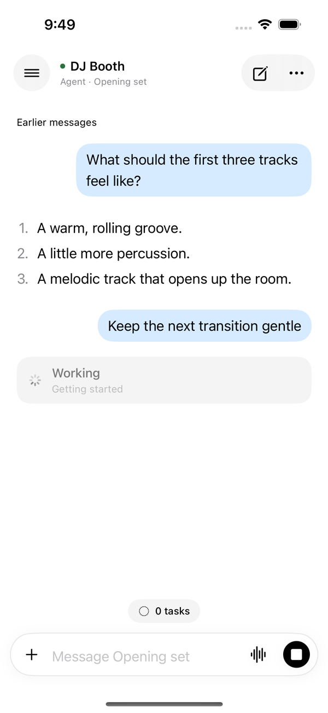 | 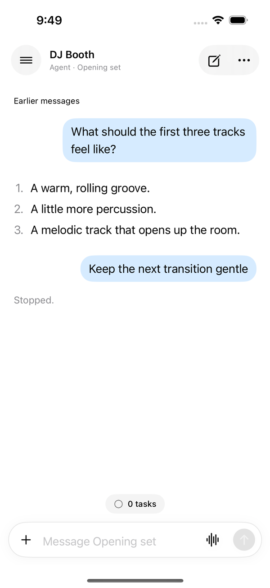 | 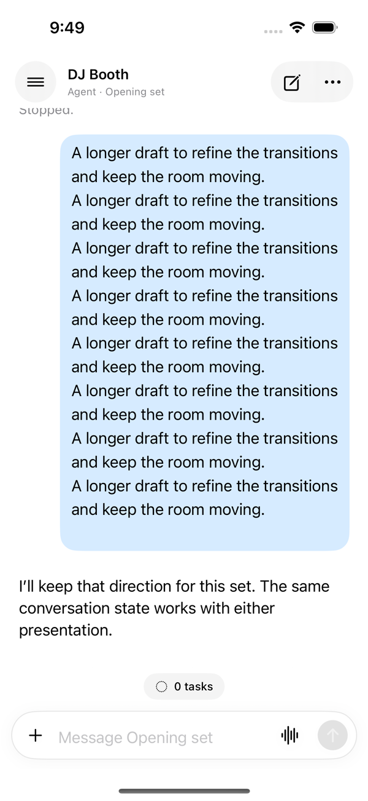 |

## Unstyled and Nanocodex presentations share state

[Watch switching presentation, conversations, independent drafts and a completed reply](component-styling.mp4)

| Bare SwiftUI | Nanocodex presentation | Nanocodex sidebar |
| --- | --- | --- |
|  |  |  |

| Separate conversation draft | Completed reply |
| --- | --- |
|  |  |

[Watch older/latest history, interrupted send, explicit retry and stop](component-recovery.mp4)

| Older history | Pending retry | Live turn | Stopped turn |
| --- | --- | --- | --- |
|  |  |  |  |

## Mobile regression captures

[Watch project navigation, search, drafts, Tasks and Agents](project-navigation.mp4)

| Project sidebar | Child conversation | Tasks | Agents |
| --- | --- | --- | --- |
|  |  |  |  |

[Watch compact activity, timeline and tool detail](mobile-activity.mp4)

| Activity | Timeline | Tool detail |
| --- | --- | --- |
| 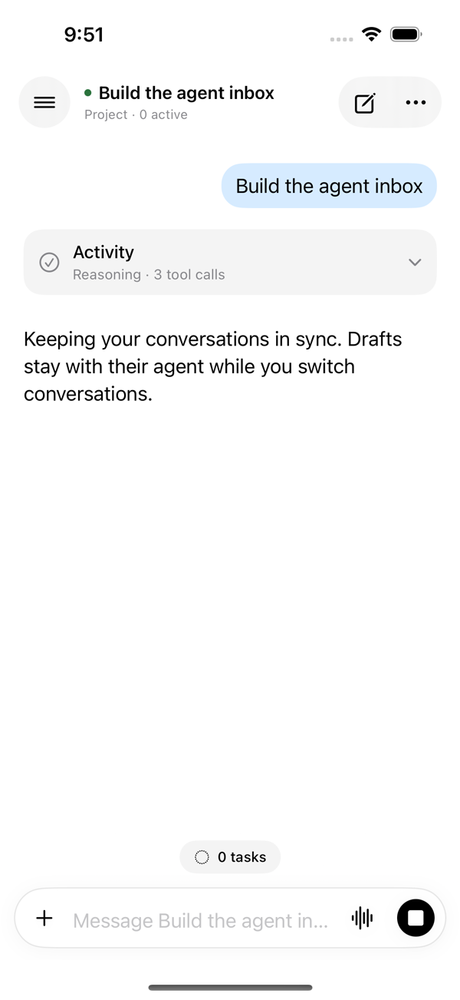 | 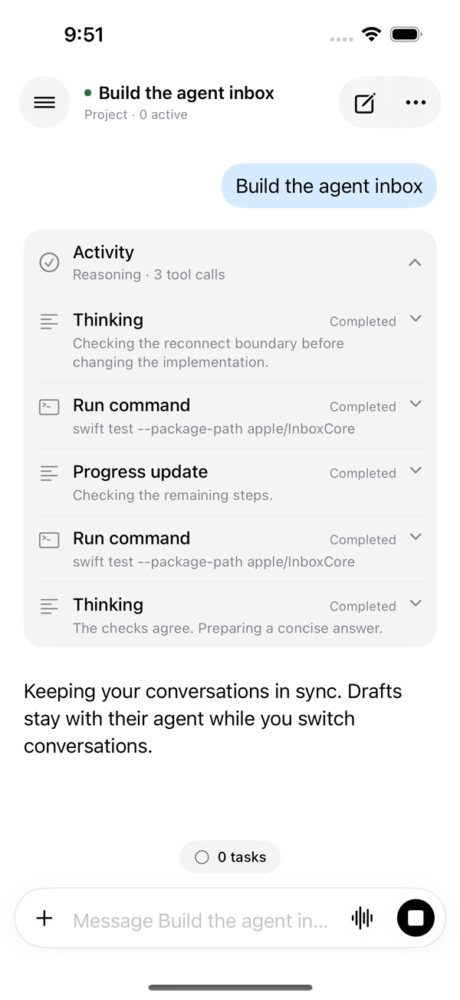 | 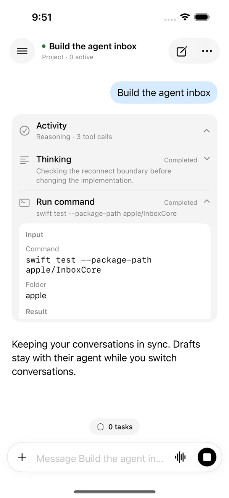 |

[Watch five-line composer expansion and draft preservation](mobile-composer.mp4) ·
[Watch send/stop behavior](mobile-send-stop.mp4)

| Composer overflow | Send/stop control |
| --- | --- |
| 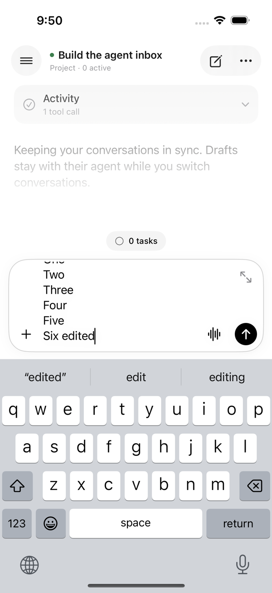 | 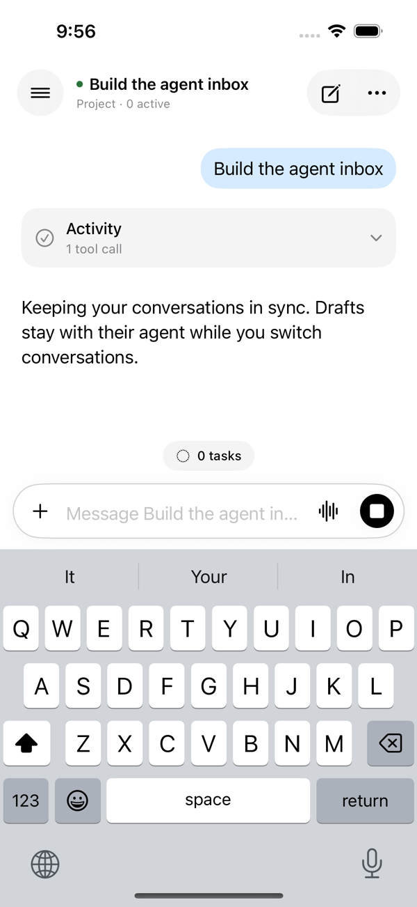 |

Screenshots are XCTest attachments from iPhone 16 / iOS 18.2 simulator runs.
Videos show the same passing test executions, trimmed by test timestamps and
resized/H.264 compressed for review. The eight selected checks cover four
component gallery flows and four existing mobile regressions. Seven passed in
the combined final run; send/stop is captured from its isolated final rerun after
making draft clearing deterministic. The simulator had ignored Cmd-A, leaving
text in the field, so that test now uses backspaces and asserts an empty draft
before checking the Stop state. The native gallery also checks that
long pending input leaves navigation and the editor accessible and that a reply
after a long message is visible at the latest position.
