# Project conversation component evidence

All media use explicit simulator fixtures. They show real SwiftUI interaction
with the shared component or the existing mobile project model; they do not
claim a live model response or a completed DJ Booth integration.

The Debug-only component gallery consumes `NanocodexChat` and
`ProjectConversationStore` through their public APIs. The same store stays alive
when switching between bare SwiftUI views and an illustrative DJ Booth theme.

The existing mobile capture covers the current project drawer, child selection,
search, separate drafts, Tasks and Agents. The shared primitive is used for the
child conversation list; the existing mobile model still owns its transcript.

## Project navigation

[Watch project navigation, search, drafts and activity](project-navigation.mp4)

| Expanded project sidebar | Child conversation | Tasks | Agents |
| --- | --- | --- | --- |
| 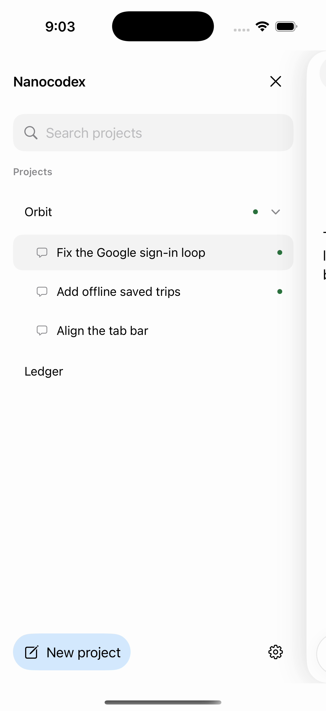 | 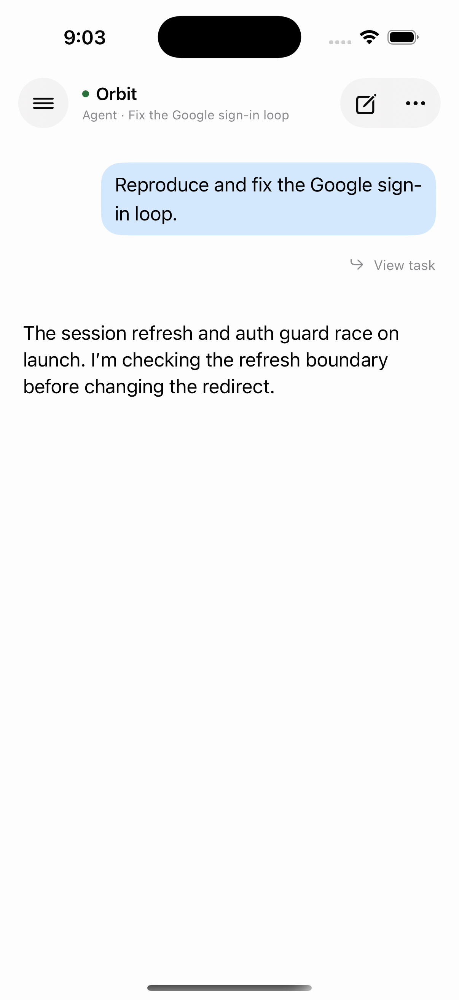 | 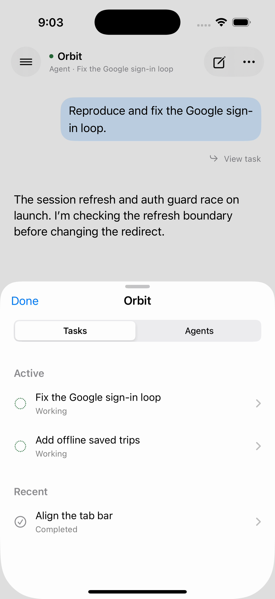 | 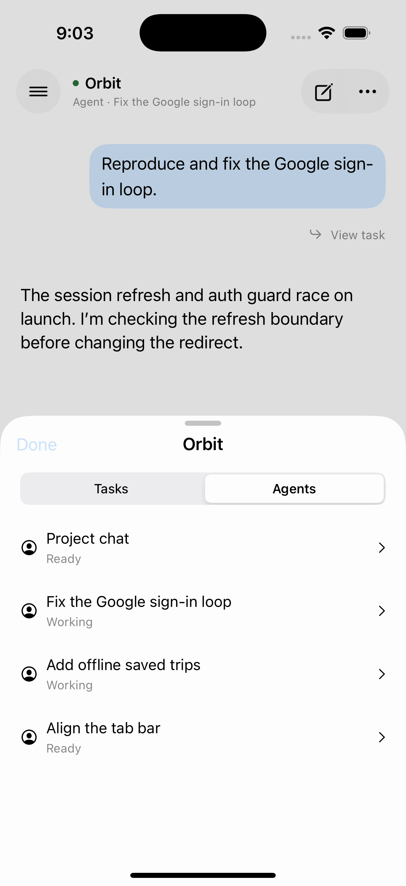 |

Recorded from `testExpandableProjectThreadsPreserveDraftsAndSearch`, which passed.
A separate subsequent simulator launch stalled and was cancelled; that stalled
launch is excluded from the clip. This clip includes the complete passing test,
with a short margin on either end. The video is resized and H.264-compressed for
review; screenshots are extracted from the same recording.

## Unstyled and custom presentations

[Watch styling, conversation switching, independent drafts and a completed reply](component-styling.mp4)

| Bare SwiftUI | Custom presentation | Custom sidebar |
| --- | --- | --- |
| 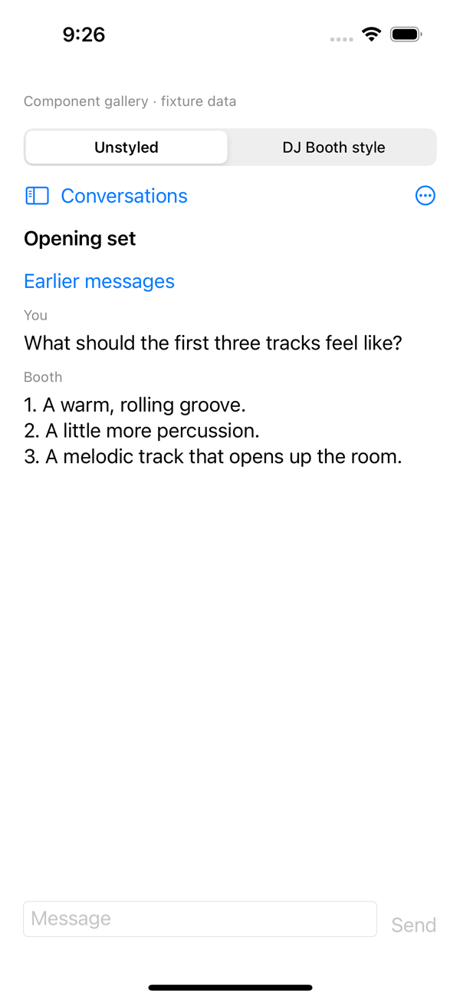 | 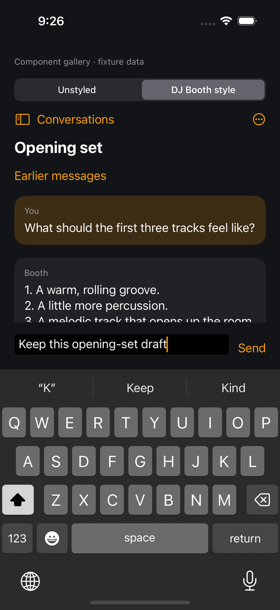 | 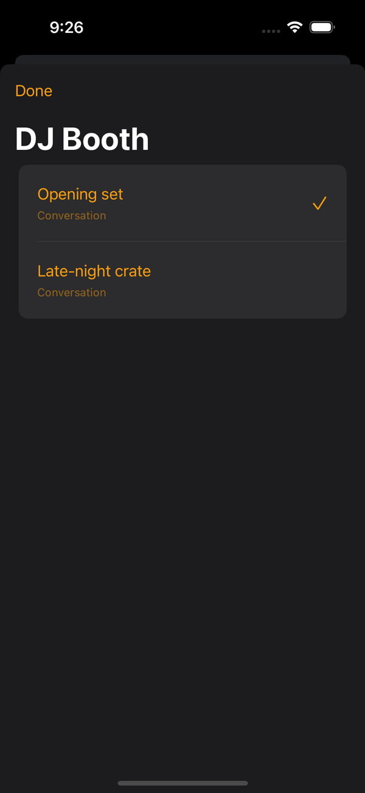 |

| Separate conversation draft | Completed reply |
| --- | --- |
| 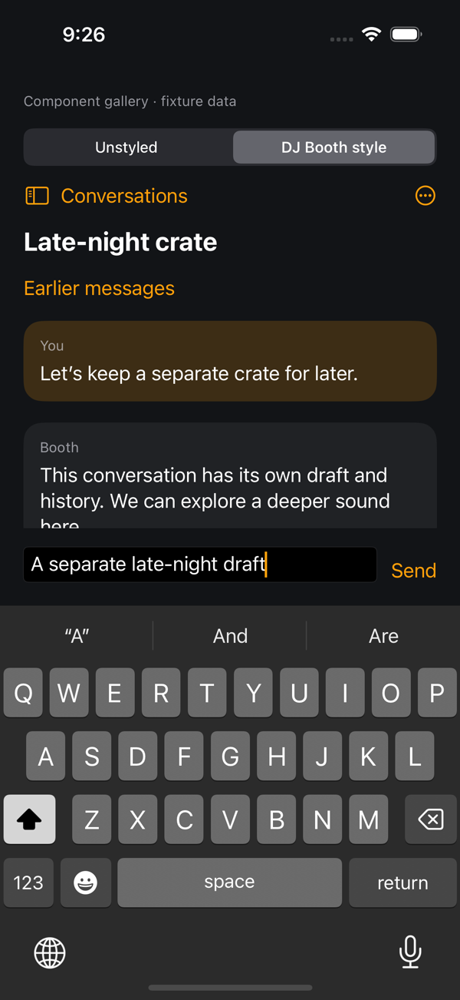 | 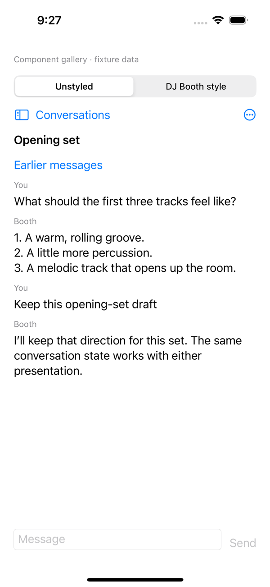 |

## History, retry and stop

[Watch older/latest history, an interrupted send, explicit retry and stopping a turn](component-recovery.mp4)

| Older history | Pending input and retry | Live turn | Stopped turn |
| --- | --- | --- | --- |
| 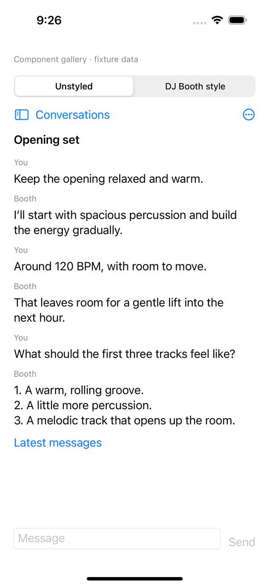 | 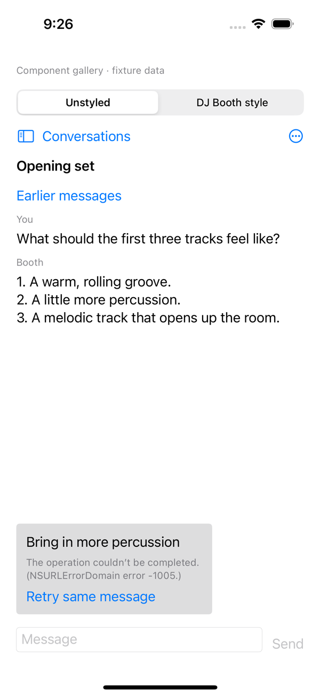 | 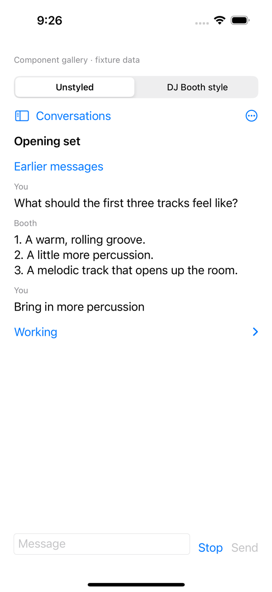 | 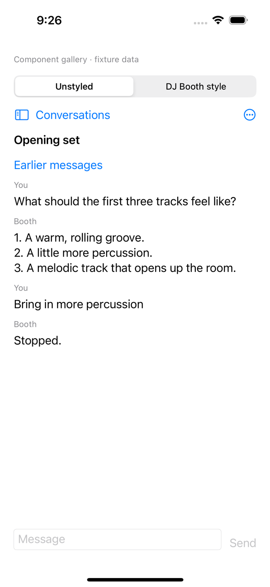 |

The gallery screenshots are XCTest attachments. Videos show the same final
`ComponentGalleryUITests` run on an iPhone 16 simulator (iOS 18.2), trimmed to each
workflow and resized/compressed for review. Both tests pass. The fixture transport
simulates a lost connection before acceptance and reuses the pending command on
explicit retry; the core transport/store tests separately verify request identity,
replay ordering and server-grant boundaries.
