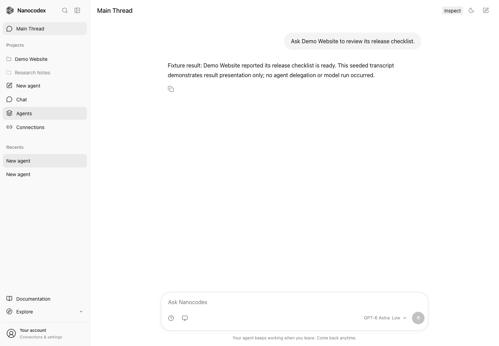
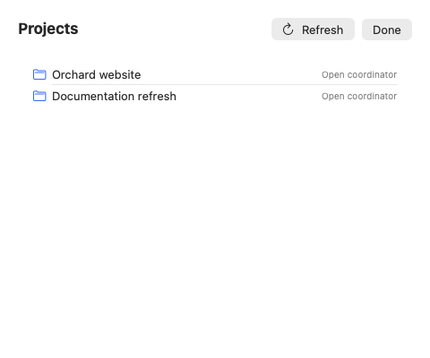
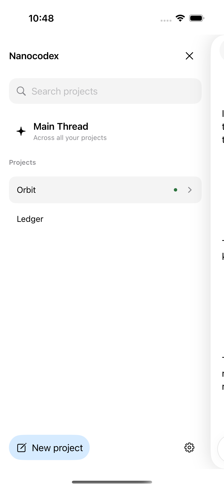
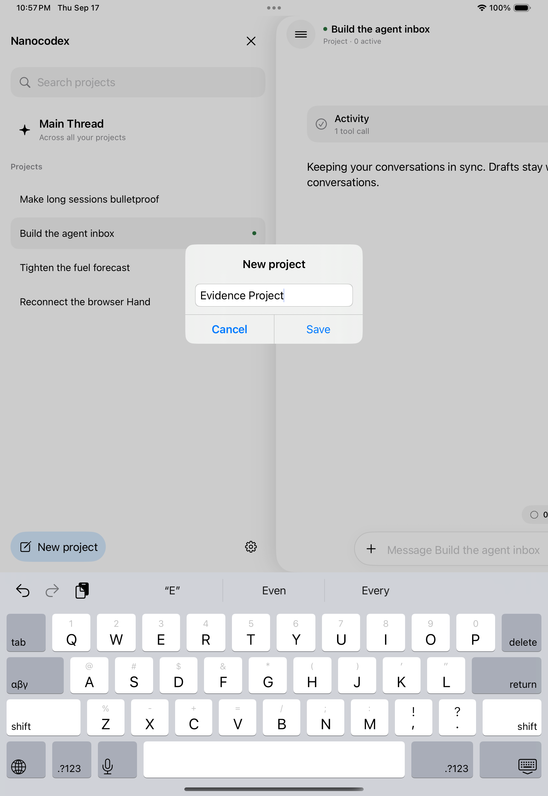

# PR #396 visual evidence

**36 screenshots and 9 short recordings of the implemented web, macOS, iPhone and iPad UI. All captures are fixture-backed and local.** None demonstrates a deployed flow, real account data, model execution or backend delegation. Source: `f517a4393b6c3ead1b2fe46d1b6470ec0e1611c1`; the later `5cb255fd` commit changes only a backend test.

## Review by platform

| Platform | Screenshots, exact captions and reproduction | Short recordings |
| --- | --- | --- |
| Full web account app | [Web evidence](media/main-thread-396/web/README.md) | [Navigation and seeded result presentation](media/main-thread-396/web/navigation.webm) |
| Native Mac app | [Mac evidence](media/main-thread-396/macos/README.md) | [Continuous native-view capture](media/main-thread-396/macos/native-view-recording.mp4) |
| iPhone 16 Pro simulator | [Mobile evidence](media/main-thread-396/README.md) | [Main Thread](media/main-thread-396/iphone-main-thread.mp4), [child/result](media/main-thread-396/iphone-child-and-result.mp4), [tasks/agents](media/main-thread-396/iphone-tasks-and-agents.mp4) |
| iPad Pro 11-inch simulator | [Mobile evidence](media/main-thread-396/README.md) | [Main Thread](media/main-thread-396/ipad-main-thread.mp4), [project creation](media/main-thread-396/ipad-project-create.mp4), [child/result](media/main-thread-396/ipad-child-and-result.mp4), [tasks/agents](media/main-thread-396/ipad-tasks-and-agents.mp4) |

## Representative screenshots

Full web app, Main Thread selected. Text explicitly describes a seeded result, not an executed task:

Native Mac Projects sheet. Project data is synthetic; selecting a row exercises the actual AppModel navigation:

Native iPhone project drawer with the dedicated Main Thread entry:

Native iPad project creation. This built-in demo flow creates a local project alias:

## Coverage matrix

| Flow | Web | Mac | iPhone | iPad |
| --- | --- | --- | --- | --- |
| Main Thread entry/open/reuse | Actual route/button flow, fixed fixture identity | Actual model methods/views, same-tab assertion | Native UI test; independent draft restored | Native UI test; independent draft restored |
| Project list/select | Actual buttons/routes | Actual Projects sheet and model selection | Native UI test | Native UI test |
| Project creation | No dedicated form in this UI; not executed | No dedicated form in this UI; not executed | Native demo creation + relaunch persistence, screenshots | Native demo creation + relaunch persistence, screenshots/video |
| Register existing project | Not executed | Not executed | Menu entry captured; no registration | Menu entry captured; no registration |
| Delegation/results | Seeded result transcript only | Seeded result transcript only | Existing fixture tasks, child navigation, completed origin-linked result | Existing fixture tasks, child navigation, completed origin-linked result |

## Validation and gaps

- iPhone: four original focused UI journeys passed; supplementary project-create/relaunch capture passed.
- iPad: three original focused journeys passed. The original creation test failed waiting for its task sheet after the project had been created. A supplementary creation/relaunch/selection journey passed. The original failure remains unresolved and is not erased by the supplemental capture.
- Mac: isolated Debug build succeeded; same-tab reuse and selected coordinator assertions passed. Capture is from actual native view bitmaps sampled at 10 Hz; no desktop input or screen capture was available.
- Web: local full app capture completed with zero retained browser console/page errors; API identities, history and outcomes are fixtures.
- Mobile screenshots use iOS 18.2 and the installed iOS 26.5 SDK, not physical hardware or iOS 26 Liquid Glass. Simulator timing gaps mean recordings are not performance evidence.
- No live canonical project registration, cross-device persistence, backend delegation/result delivery, or deployed end-to-end flow is shown. Web/Mac create/register tool conversations remain uncaptured.

All media were inspected. [SHA-256 manifest](media/main-thread-396/manifest.json) records the final files. No production app source changes are included in the evidence commits; capture-only instrumentation lives under docs. The PR's existing test claims should be preserved, with these new capture results and limitations appended separately.
