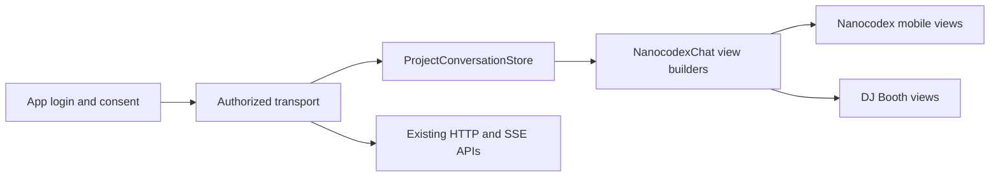

# Project conversations as an unstyled Swift component

A third-party app should bring its own layout and visual identity while Nanocodex owns conversation identity, turn admission, history, and live updates. The iPhone app and DJ Booth should not maintain separate versions of those behaviors.

The component is split into two local Swift packages:

- `InboxCore`: project-scoped transport, observable conversation state, transcript projection and navigation policy. It knows no colors, fonts or layout.
- `NanocodexChat`: SwiftUI lifecycle and content builders. The host supplies sidebar rows, messages, activity disclosure, composer, empty/loading/error states, and navigation. It has no dependency on the existing styled `NanocodexUI` package.

`NanocodexUI` remains an optional choice for Markdown, media and other presentation. A host can use it selectively or render its own views.

## Scope and authorization

At the inspected repository baseline, Connect grants bind one `agentId`. The proxy checks that identity on every agent request; history and output are separately granted capabilities. A grant cannot enumerate the account's conversations, create arbitrary agents, or authorize other agents merely by including them in a Swift array.

The first implementation uses this existing boundary. A transport supplies an immutable authorized roster. Replacing an account or grant requires a new transport/store and a new SwiftUI identity. A project name is presentation data. The component does not ask a third-party app to hold an account API key.

The desired full journey needs an additional server contract: the user selects or creates the named DJ Booth project during consent, the grant records its immutable project ID, and every list/create/read/send/stream operation checks current project membership and grant validity. Revocation must affect existing streams too. Creating a new conversation needs a stable creation ID, and granting a project must specify whether future conversations and delegated threads are included. These semantics should be explicit in consent and enforced by the server before a multi-conversation DJ Booth integration ships.

Do not replace that contract with device-local `InboxProject` grouping or account-wide enumeration followed by filtering. Existing local project naming can remain an app navigation preference while server authorization is added.

## Shared behavior

- Conversation and turn identity are captured before asynchronous work. A late history or stream callback cannot overwrite a new selection.
- Each conversation keeps its own draft. A composer binding captures its original conversation, including while an old editor is being removed.
- A send has one request ID. An uncertain response remains visible for explicit retry with the same identity and input. Reads may reconnect; writes do not retry automatically.
- Stream replay follows delivered event/checkpoint cursors. A state snapshot can report activity but must not skip undelivered events.
- Active and queued turn state comes from server state plus ordered events, not guesses from a truncated transcript. Only the head of the queue is executing.
- History is bounded in memory, with explicit older paging and a way to return to live messages. Browsing older content must not silently replace it with the latest page.
- Foreground lifecycle belongs to one owner. Suspending the component cancels live observation; it does not cancel the server's turn.
- Navigation uses summaries, preserves row order during streaming and searches the complete supplied roster.

## Mobile presentation

Keep one conversation and one composer on screen. A compact drawer opens the conversation roster; a larger device can place the same content in a sidebar. Show user messages and final replies in the main transcript, with a single expandable activity group per turn. Keep pending input and failures visible. Separate stopping the current turn from sending a queued follow-up; changing presentation must not change those actions.

The initial mobile adoption uses the shared roster policy and unstyled list content. The existing mobile model still owns its current transcript, media, voice, tools and reading-position behavior. Replacing that model is a separate integration step that needs simulator coverage for those features; adding a second observer beside it would create competing state owners.

## DJ Booth adoption

After the component is validated, DJ Booth can supply its dark sidebar, music-specific empty state and message/composer views. Its current `MusicAgentConversation` and `MusicAgentView` have their own history/pending logic; migrate that behavior into the shared store rather than layering another transcript cache over it. Login, consent and music tool registration stay with DJ Booth. The server project grant extension above is required for the full named-project sidebar, beyond the existing grant's single conversation.
