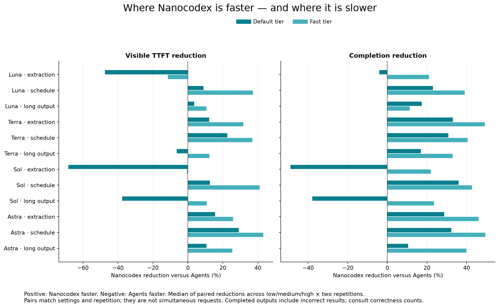

# Deployed Cloudflare Nanocodex versus OpenAI Agents

Measured 11 September 2026 from the same developer workstation in Athens, using
one authorized OpenAI API key for all three paths. This extends the
[earlier Node / Responses WebSocket / HTTP / Agents study](../agents-comparison-2026-09-11/README.md)
with actual deployed managed Workers, larger tasks, more reasoning levels, and
fresh versus repeated-session measurements.

Read the [results and charts](RESULTS.md), including accuracy, startup, warm-session,
higher-reasoning and delegation comparisons.



## What changed

Restricted agents previously refreshed account MCP/hosted-tool catalogs even
though those catalogs were excluded from their runtime. First-turn startup also
retrieved memory/history outside the configured tool policy. The Worker now skips
unavailable catalogs and filters the existing startup retrieval plan before
new admission, including voice prefetch. Previously retained receipts are preserved
for recovery. Default agents retain their existing behavior.
This removes unnecessary I/O and avoids injecting irrelevant startup context.

In the 24 baseline construction traces, account catalog refresh had a 301 ms
median. It was skipped in all 145 main-matrix construction traces (144 sessions,
including one reconstructed runtime). Median runtime-ready time in those traces
fell from 344.5 ms to 50 ms. The matched client pre-model median fell from
2.175 s to 1.878 s; those client observations also contain deployment and
concurrency effects.

The live experiment also reproduced a construction failure for `tools: []`: the
MCP builder rejected an empty server map, then rejected MCP options when MCP was
disabled. The empty-server path now calls `createTools({tools, mcp: false})` without
MCP options. Capacity logs include the session ID so construction phases can be
joined to measured requests.

A later deployment adds `configuration.multi_agent` using the existing Rust
subagent runtime. `enabled: false` removes delegation, while explicit enablement
supports a concurrency limit (six by default). Omission preserves legacy behavior.
The additional delegation-disabled study is kept separate from the main matrix.

One main-matrix Sol/high extraction trial returned a correct final result through
SDK polling but no live text after `model.call.started`. Its TTFT remains missing.
The tail recorded a replaced Durable Object, followed by event-persistence errors
on the old instance. Heartbeat comments kept that stale stream alive. The final
deployment checks the durable cursor before sending heartbeats, closing the stream
on storage failure so the SDK can reconnect. A Workers-runtime regression test
covers missed publication and stale storage. The exact platform replacement has
not been forced in a live test; the earlier observation remains in the results.

These changes preserve durable admission, replay, credential ownership and cleanup.
They do not establish that the architecture is globally optimal.

## Experimental controls

- Main matrix: four models × low/medium/high reasoning × default/fast tier × three
  workloads × two repetitions × three paths = 432 planned fresh generations.
  At most four jobs run concurrently. Configuration order is shuffled with seed
  `20260911`; paths for each configuration are adjacent, in alternating order.
- Baseline: 24 Nanocodex fresh generations on Luna/Sol, low/high, default tier,
  all three workloads, two repetitions, concurrency two. These precede the
  optimization deployment; before/after comparisons are observational and can
  contain provider, cache, deployment and concurrency effects.
- Warm study: repeated identical schedule prompts in the same session, Luna,
  Terra, Sol and Astra, low/high, default tier, two repetitions, concurrency two.
  A warm result includes prior conversation context and cache effects. It does
  not isolate transport reuse, and a fresh session does not guarantee a cold
  provider cache or a cold Worker isolate.
- Advanced reasoning: xhigh/max on the schedule task with both hosted-agent
  paths, default tier, two repetitions. Unsupported configurations, if any, are
  reported as errors rather than silently replaced with another effort. This later
  cohort can benefit from provider caches warmed by earlier work; it does not
  isolate the causal effect of raising the reasoning budget.
- Delegation-disabled study: Luna/Sol, low/high, default tier, all three tasks,
  two repetitions, both hosted-agent paths, concurrency two. Nanocodex explicitly
  disables delegation; OpenAI retains its already-disabled default. This later
  cohort tests the final control and is not pooled into the original matrix.
- No application-level retries of measured generations. A 300-second generation
  observation deadline is used. Usage collection and session cleanup occur
  outside measured completion. Cleanup retries never create another generation.

The same supplied prompt and instructions are used for each path. The instructions
request only the supplied data, no tools, and JSON without Markdown. Nanocodex uses
`configuration.tools: []` and a disabled-network environment; OpenAI Agents uses
`environment.type: none` and `tools: []`; Responses HTTP has no tools. No native
sandbox task is benchmarked.

Built-in harness prompts and orchestration differ. OpenAI disables delegation
when `multi_agent` is omitted; Nanocodex retains default subagent orchestration
even when the application tool list is empty. Some Nanocodex trials delegated.
All 13 main-matrix trials reporting root tool calls used Luna.
The separate delegation-disabled cohort aligns this policy. Reported model calls include child responses, deduplicated by provider response
ID. This is an API-level comparison, not a token-identical inference experiment.
[OpenAI delegation settings](https://developers.openai.com/api/docs/guides/agents-api/multi-agent)

## Workloads and correctness

The checked-in [fixture generator](../../js/nanocodex/scripts/agents-workloads.mjs)
produces all inputs and computes exact expected outputs without model grading.

| Workload | Supplied prompt | Required result |
| --- | ---: | --- |
| Extraction | 8,858 characters, 120 synthetic tickets | Filter status/severity, retain ordered IDs, calculate regional counts and minute totals |
| Schedule | 1,178 characters, 18 dependent jobs | Earliest start/finish for every job with unlimited workers; makespan 55 |
| Long output | 4,151 characters, 60 invoices | Preserve every input field, calculate invoice totals and grand total; roughly 5 KB JSON |

Correctness requires valid JSON and an exact structural match; object-key order
is ignored, array order is preserved. Wrong totals, missing rows, prose and fenced
JSON fail. Latency summaries include completed incorrect outputs, so they must
be read alongside correctness. Failed generations are excluded from completion
medians and counted explicitly. Two trials per fine-grained cell do not support
reliable tail percentiles, confidence intervals, or an SLA claim.

## What each clock measures

Nanocodex fresh TTFT/completion starts **before `Agent.create()`**, including the
public front Worker, authentication, session Durable Object creation, SSE
subscription, turn admission and execution. Warm timing starts before submitting
the next prompt and subscribing from the prior terminal cursor. The SDK shares its
replayable event stream between observers and the result helper.

OpenAI Agents fresh timing starts before create-with-input and SSE in one request.
Warm timing includes connecting a stream and then posting a new input event.
Responses HTTP starts before its streamed request. Visible TTFT is the first
nonempty root text delta, not a protocol-created event or reasoning output.
Nanocodex completion is resolved `turn.result()`; OpenAI completion is the terminal
root-turn/response event. Saved output is retrieved after the measured terminal
for correctness when available. Missing live text cannot yield a valid TTFT. Nanocodex may still produce a valid
end-to-end completion time through the SDK’s durable turn-state polling fallback;
that is explicitly identified rather than reconstructed as a stream timestamp.
[OpenAI event semantics](https://developers.openai.com/api/docs/guides/agents-api/sessions/events)

The table also records create time, acceptance, first model start, model/connection
spans, the final-text-to-completion gap, and observed text characters per second.
Checkpoints serialize local captures while other matrix jobs can be in flight;
The main run’s largest recorded checkpoint pause was 479 ms.
`max_checkpoint_ms` bounds each observed checkpoint pause, not all possible client
scheduling noise. This workstation was not an isolated load-test machine.
Character throughput excludes the first text batch; it is not billed tokens per
second. Model-token usage separately includes input, cached reads/writes, output
and reasoning tokens where reported. All completed main-matrix outputs parsed as JSON; correctness failures were
content mismatches on extraction or long-output tasks. Model spans can include connection time;
do not add them together as independent durations.

## Deployment and provenance

The experiment uses three isolated services: `nanocodex-perf-front-0911`,
`nanocodex-perf-managed-0911`, and `nanocodex-perf-egress-0911`. The front imports the
production account-to-managed routing function; the managed and egress Workers
run their actual implementations with private Durable Object namespaces and an
isolated account. The broker holds the same OpenAI key used by the direct paths.
No production account credential was replaced.

The fixture uses its own R2 bucket for all managed R2 bindings. Production splits
these bindings across buckets. X/chief/AI-search bindings are absent, and the
workloads do not exercise those integrations. The production Sandbox container
image is registered for genuine lifecycle cleanup, but generation tasks use the
restricted embedded environment. This is production code on Cloudflare with an
isolated topology, not a measurement of the production account's normal catalog.

- Baseline managed version: `64763061-ed51-4ba9-818c-9272b5b5433d`.
- Optimized managed version: `64e62eb3-447e-44fb-b451-375c90bc0b73`.
- Delegation-control version: `4e78114f-f93a-4d04-81f5-2bf36943599e`.
- Two preliminary production arithmetic probes used the production account's
  ChatGPT credential. Their roughly 8.75s/4.13s pre-model spans are exploratory,
  use a different credential and configuration, and are excluded from this matrix.
- The first delegation pilot immediately after upload hit the previous Worker
  version (`64e62…`) and rejected `multi_agent`. The trace identifies propagation
  delay; no session was created. A separate fresh/warm pilot passed on the new
  version before the measured cohort began. Both pilot observations are retained
  locally and excluded from cohort summaries.
- Instrumentation pilots are excluded, including one OpenAI stream that closed
  after session creation. That session was subsequently deleted successfully.

`measurements.json` contains reduced per-trial observations, usage, correctness,
HTTP phase timings and cleanup status. `summary.json` includes exact source-file
hashes, run windows, requested concurrency and checkpoint overhead. Verbose local
wire captures and private Wrangler tails are not committed. Saved events omit
provider encrypted content and obfuscation; credentials are never recorded.
`server-profile.json` contains only benchmark-session construction phases and
attributed invocation clocks and bounded failure classifications, without request
headers. `runtime-source.json` records the final runtime commit and source hashes.

## Cost interpretation

Model cost estimates use the [published September 11 pricing](https://developers.openai.com/api/docs/pricing):
ordinary input / cached input / cache write / output dollars per million tokens
are Luna `0.2 / 0.02 / 0.25 / 1.2`, Terra `2 / 0.2 / 2.5 / 12`, Sol
`4 / 0.4 / 5 / 20`, and Astra `10 / 1 / 12.5 / 50`, doubled for fast mode.
Fast tier is assumed from the request unless the response reports it. All inputs
in this study are below the long-context threshold. The study uses standard
reasoning mode, not pro mode, and does not benchmark native hands, voice,
multimodal input or sustained multi-client load.

Cache reads and writes are subsets of input. Missing cache-write counts produce
an interval on the possible write premium for **reported tokens only**. This is
not an upper bound on the bill: late/missing usage and child activity can be
omitted, and infrastructure or tool charges are separate. Unknown usage stays
unknown; a failed observation is not priced at zero. The main matrix includes one
OpenAI overload error and one completed OpenAI turn whose usage was still missing
after post-completion polling. The warm cohort includes another completed OpenAI
turn without reported usage.

Cloudflare Durable Object billing meters requests, active duration and SQLite
activity; overlapping request wall spans are not independent billable duration.
The included monthly allocation and account-level rounding affect actual charges.
The observation window includes isolated setup/pilots as well as the planned
cohorts; infrastructure totals are not apportioned across the three API paths.
Cloudflare's namespace analytics provide duration and SQL counters; live-tail CPU
and wall clocks are diagnostic evidence, not invoice totals.
[Durable Object pricing](https://developers.cloudflare.com/durable-objects/platform/pricing/),
[metrics definitions](https://developers.cloudflare.com/durable-objects/observability/metrics-and-analytics/)

Snapshot window: `2026-09-11T09:30:00Z` through `2026-09-11T11:04:07Z`;
retrieved after cleanup. Analytics can still arrive late or be adaptively sampled.

| Observed infrastructure meter | Quantity | Unrounded paid-rate component (USD) |
| --- | ---: | ---: |
| Durable Object duration | 671.285 GB-s | $0.008391 |
| SQLite rows read | 3,212,716 | $0.003213 |
| SQLite rows written | 675,832 | $0.675832 |
| DO invocations | 14,093 | $0.002114 |
| **DO component subtotal** | | **$0.689550** |
| Worker CPU | 7,143.754 ms | $0.000143 |
| Known R2 Standard operations | 1,236 | $0.005164 |

SQLite writes dominate the measured infrastructure components. The separately
observed Worker request count (4,250) includes service-binding hops;
those hops are not additional billed Worker requests. This table excludes Worker
request fees, container/image charges, SQL/R2 GB-month storage, included monthly
allowances and billing-unit rounding. It is not a total invoice or a bill bound.
[Worker pricing](https://developers.cloudflare.com/workers/platform/pricing/),
[R2 pricing](https://developers.cloudflare.com/r2/pricing/)

The container application reported `ready`, and its usage query returned no rows.
That does not establish zero charges; [the observation](container-observation.json)
retains the query and units. Session placement appeared in FRA, MRS, MXP, PRG and
VIE. This is one client region, not a multi-region placement optimization study.
Cloudflare's aggregate CPU/memory/fatal-error counters were zero; the separate
live tail still captured the stale-instance failure described above.

Across the 600 planned study trials, reported model-token costs total
**$36.9581–$39.0424**, with 3 observations missing usage.
Pilots and the earlier 96-trial study are excluded from that model subtotal.


## Reproduce

Use the isolated deployment fixture in
[`js/managed/benchmark`](../../js/managed/benchmark/README.md). Load credentials into
`OPENAI_API_KEY`, `NANOCODEX_API_KEY`, and `NANOCODEX_MANAGED_URL` without putting
secrets in shell history. With a separately provisioned test account:

```sh
node js/nanocodex/scripts/cloudflare-agents.bench.mjs \
  --output=output/your-run/matrix-raw.json \
  --paths=nanocodex_cloudflare,openai_agents,responses_http \
  --repetitions=2 --concurrency=4 --label=matrix --version=YOUR_WORKER_VERSION

node js/nanocodex/scripts/cloudflare-agents.analyze.mjs \
  output/your-run/matrix-raw.json
uv run --no-project --with matplotlib python \
  js/nanocodex/scripts/cloudflare-agents.plot.py output/your-run
```

Use `--efforts=low,high --tiers=default --workloads=schedule --turns=2`
for repeated-session measurements. Choose a new output filename for each run.
Set `--delegation=disabled` for the explicit no-delegation cohort.
The session journal supports cleanup after client failure; the runner does not
resume incomplete matrices or silently overwrite their missing trials.

## Validation

The final runtime passed 74 focused Worker tests, four durable-stream tests,
29 SDK/runtime contract tests, five SDK reconnection tests, managed and fixture
TypeScript checks, and public declaration/package checks. The actual Worker was
uploaded and the fresh/warm no-delegation pilot passed before the final cohort.
See [validation details](validation.json) and [runtime provenance](runtime-source.json).

The generated charts were visually inspected. Full matrix consistency, monotonic
client timing, exact fixture validation and session cleanup are checked when
producing the final artifacts.

## Cleanup

All 430 journaled hosted sessions (including pilots) have confirmed deletion.
The 600-trial study itself used 424 unique hosted sessions; Responses HTTP has no
hosted session to delete. Cleanup finished at `2026-09-11T11:02:04.541852+00:00`.

The three isolated Workers, all 15 original Durable Object namespace IDs, the
container application and the R2 bucket were removed. API inventories confirmed
that none remained. Temporary credential copies and private tails were removed;
the original provider credentials, Wrangler login and shared production image
were preserved. Production code was not deployed by this experiment.
See the [cleanup record](cleanup.json).
