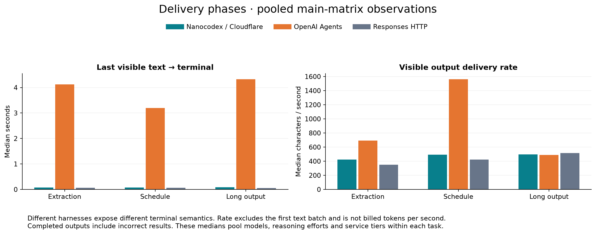
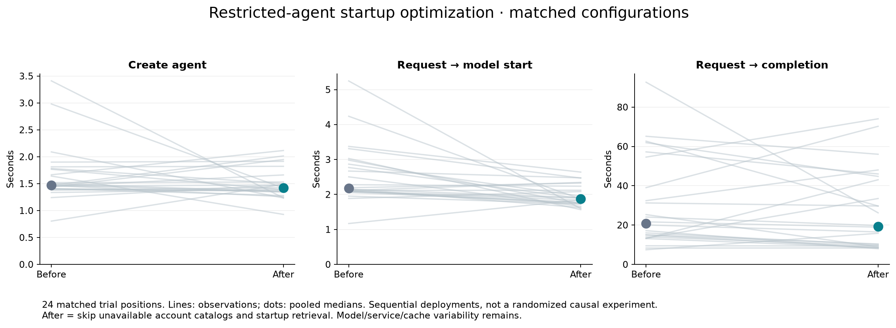
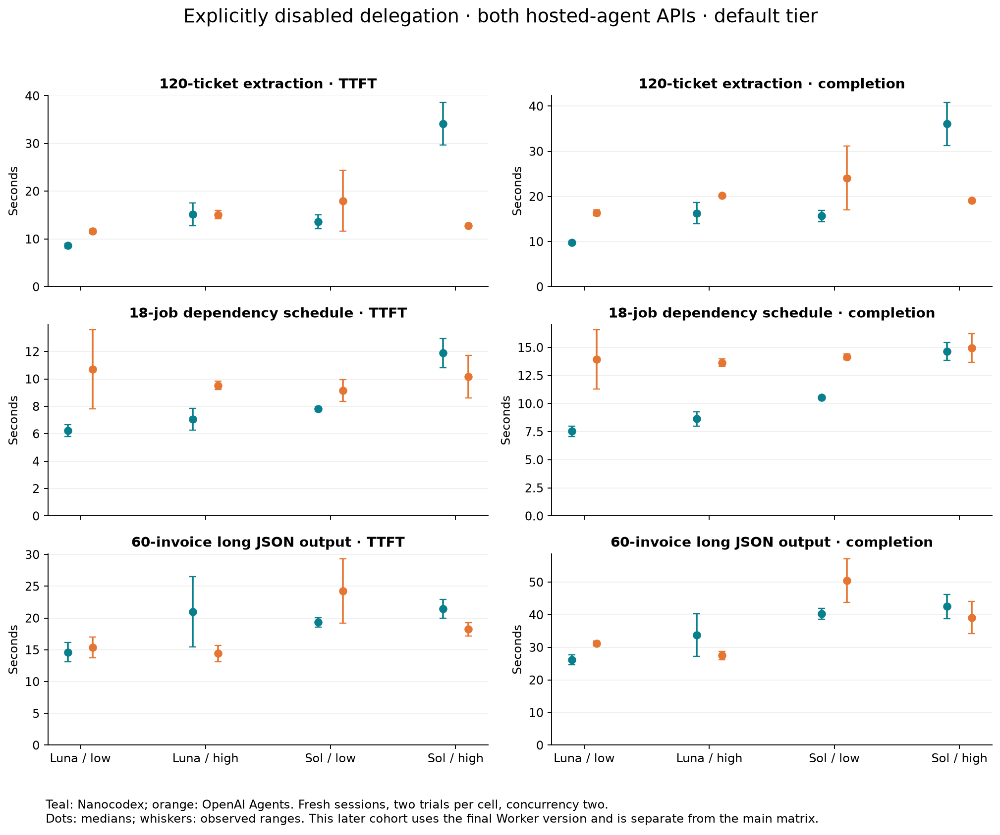
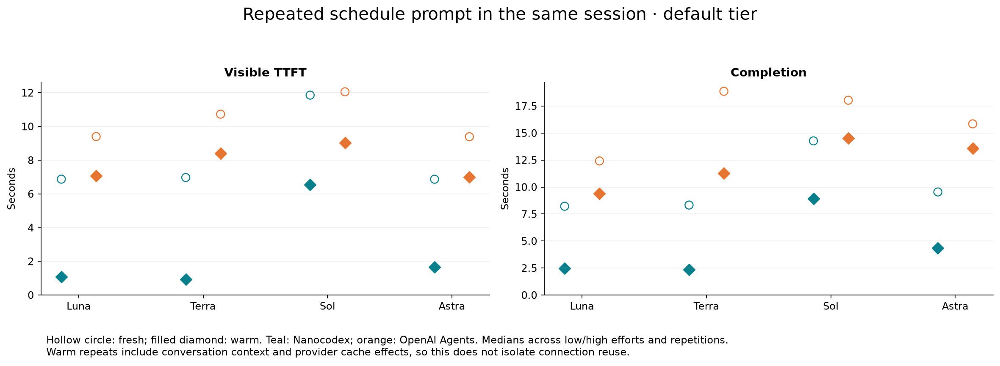
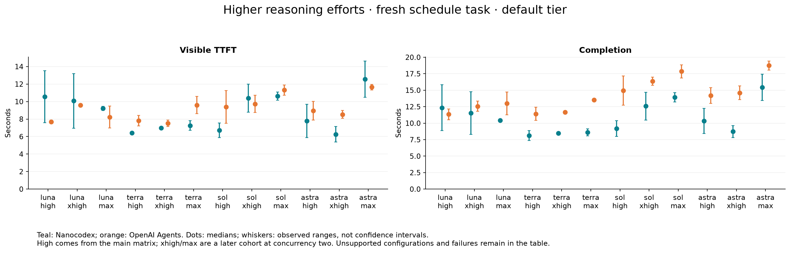
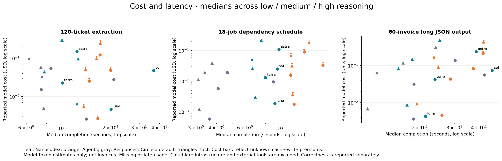

## Results

| Main matrix path | Correct / attempted | Generation errors | Completed without TTFT | Visible TTFT median (s) | Completion median (s) |
| --- | ---: | ---: | ---: | ---: | ---: |
| Nanocodex / Cloudflare | 137/144 | 0 | 1 | 9.51 | 12.74 |
| OpenAI Agents | 138/144 | 1 | 0 | 11.00 | 17.38 |
| Responses HTTP | 136/144 | 0 | 0 | 5.40 | 9.17 |

The pooled medians above describe this balanced task/model matrix. For matched
within-setting comparisons (including completed incorrect outputs):

- Visible TTFT: Nanocodex faster in **100/142** pairs; median paired reduction **15.8%**. Restricting to pairs where both answers were correct: **16.8%** across 130 pairs.
- Completion: Nanocodex faster in **121/143** pairs; median paired reduction **29.3%**. Restricting to pairs where both answers were correct: **30.2%** across 131 pairs.

### Text delivery and terminal notification

| Path | Last text → terminal median (s) | Visible characters / second median |
| --- | ---: | ---: |
| nanocodex_cloudflare | 0.08 | 471.6 |
| openai_agents | 4.01 | 693.4 |
| responses_http | 0.06 | 423.4 |

These clocks describe client-visible events. The two harnesses expose different
terminal semantics; a larger completion advantage need not imply faster token
generation. Character rate excludes the first batch and is not billed token throughput.

The chart exposes settings where the advantage reverses. For default-tier
Sol extraction, Nanocodex’s median pre-model span was 2.12 seconds,
versus 28.54 seconds to visible text. Reported reasoning-token medians
were 969.5 for Nanocodex and 515 for Agents. This is consistent
with inference/harness behavior contributing substantially to that gap;
the measurements do not attribute all of it to Cloudflare routing. This
comparison is observational, not a causal decomposition.

Missing TTFTs are excluded from TTFT medians. Failed generations remain in
attempted/quality counts; missing usage remains unknown. The [methodology](README.md)
records observed failure details and the resulting recovery fix.

| Main path | Reported model-token subtotal (USD) | Missing usage |
| --- | ---: | ---: |
| nanocodex_cloudflare | $13.2337 | 0 |
| openai_agents | $12.2555–$14.0097 | 2 |
| responses_http | $6.7332 | 0 |

Intervals account only for unknown cache-write premiums on reported tokens.
They exclude missing usage, infrastructure and other charges; they are not bill bounds.

### Startup optimization

| Matched Nanocodex subset | Before median (s) | After median (s) |
| --- | ---: | ---: |
| Create | 1.47 | 1.42 |
| Create through first model start | 2.18 | 1.88 |
| Completion | 20.84 | 19.36 |

These deployments were measured sequentially and at different concurrency. The
server traces directly establish which startup calls disappeared; the total
latency difference also includes provider/cache variability.

### Explicit delegation control

- Visible TTFT: Nanocodex faster in 14/24 pairs; median paired reduction 4.4%.
- Completion: Nanocodex faster in 17/24 pairs; median paired reduction 16.1%.

This later cohort contains 24 Nanocodex trials, with 24 correct outputs and 0 trials reporting root tool calls. It is not pooled into the main matrix.

### Warm sessions and higher reasoning

| Schedule cohort | Path | Correct / attempted | TTFT median (s) | Completion median (s) |
| --- | --- | ---: | ---: | ---: |
| fresh | nanocodex_cloudflare | 16/16 | 7.60 | 9.54 |
| fresh | openai_agents | 16/16 | 9.97 | 16.95 |
| warm | nanocodex_cloudflare | 16/16 | 1.29 | 3.31 |
| warm | openai_agents | 16/16 | 7.96 | 12.17 |

Warm repeats include retained conversation context and caching; they are not
independent cold requests. Higher reasoning results and availability are shown
separately below and in the full table.

### Cost and detailed evidence

- [Default-tier detailed chart](latency-default.png) and [fast-tier detailed chart](latency-fast.png).
- [Every configuration, correctness count, observed range, token count and cost](TABLE.md).
- [Machine-readable findings](findings.json), [measurements](measurements.json) and [summary](summary.json).
- [Cloudflare namespace metrics](cloudflare-metrics.json) and [server construction traces](server-profile.json).
